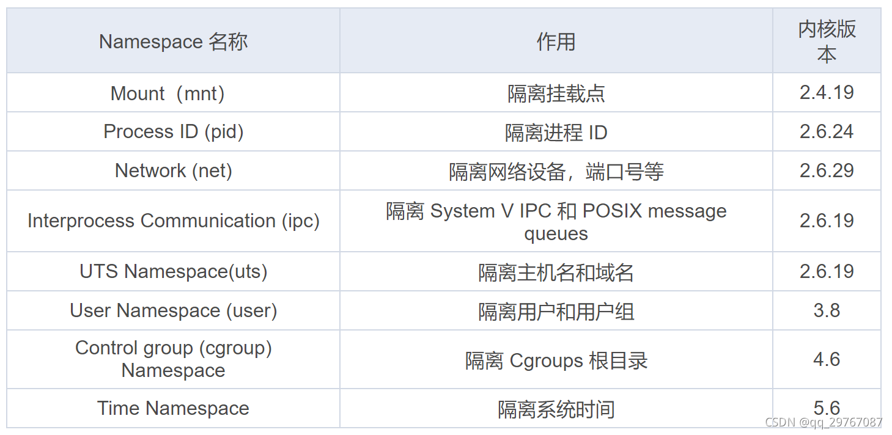
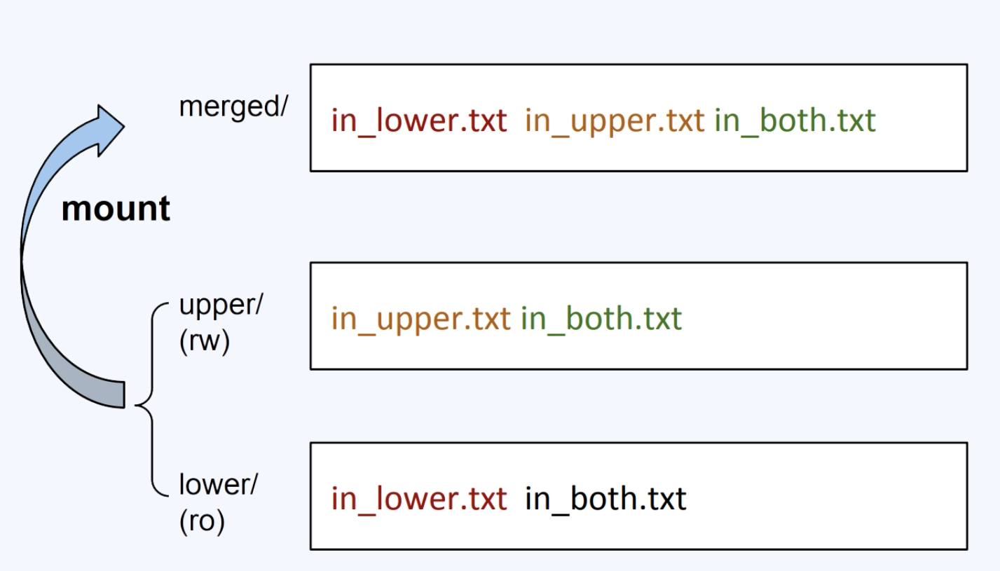

# 容器核心技术

## 1. Namespace

### Namespace 概述

Linux Namespace 是一种 Linux Kernel 提供的资源隔离方案：
- 系统可以为进程分配不同的 Namespace；
- 并保证不同的 Namespace 资源独立分配、进程彼此隔离，即 不同的 Namespace 下的进程互不干扰。

最新的 Linux 5.6 内核中提供了 8 种类型的 Namespace：


### Linux 内核代码 Namespace 实现

进程数据结构
```c
struct task_struct {
      ...
      /* namespaces */
      struct nsproxy *nsproxy;
      ...
}
```

Namespace 数据结构
```c
struct nsproxy {
      atomic_t count;
      struct uts_namespace *uts_ns;
      struct ipc_namespace *ipc_ns;
      struct mnt_namespace *mnt_ns;
      struct pid_namespace *pid_ns_for_children;
      struct net         *net_ns;
};
```

### Linux 提供的操作 Namespace 的 API

1. clone() 函数

可以通过 clone() 在创建新进程的同时创建 namespace。clone() 在 C 语言库中的声明如下：
```c
/* Prototype for the glibc wrapper function */
#define _GNU_SOURCE
#include <sched.h>
int clone(int (*fn)(void *), void *child_stack, int flags, void *arg);
```

- `fn`：指定一个由新进程执行的函数。当这个函数返回时，子进程终止。该函数返回一个整数，表示子进程的退出代码。
- `child_stack`：传入子进程使用的栈空间，也就是把用户态堆栈指针赋给子进程的 esp 寄存器。调用进程 (指调用 clone() 的进程) 应该总是为子进程分配新的堆栈。
- `flags`：表示使用哪些 CLONE_ 开头的标志位，与 namespace 相关的有 CLONE\_NEWIPC、CLONE\_NEWNET、CLONE\_NEWNS、CLONE\_NEWPID、CLONE\_NEWUSER、CLONE\_NEWUTS 和 CLONE\_NEWCGROUP。
- `arg`：指向传递给 fn() 函数的参数。

2. setns() 函数

通过 setns() 函数可以将当前进程加入到已有的 namespace 中。setns() 在 C 语言库中的声明如下：
```c
#define _GNU_SOURCE
#include <sched.h>
int setns(int fd, int nstype);
```

- `fd`：表示要加入 namespace 的文件描述符。它是一个指向 /proc/\[pid\]/ns 目录中文件的文件描述符，可以通过直接打开该目录下的链接文件或者打开一个挂载了该目录下链接文件的文件得到。
- `nstype`：参数 nstype 让调用者可以检查 fd 指向的 namespace 类型是否符合实际要求。若把该参数设置为 0 表示不检查。

3. unshare() 函数和 unshare 命令

通过 unshare 函数可以在原进程上进行 namespace 隔离。也就是将调用进程移动到新的 Namespace 下： unshare() 在 C 语言库中的声明如下：
```c
#define _GNU_SOURCE
#include <sched.h>
int unshare(int flags);
```

### Namespace 常用操作命令

查看当前系统的 namespace：`lsns -t <type>`

查看某进程的 namespace：`ls -la /proc/<pid>/ns/`

查看当前进程的 ns：`ls -la /proc/$$/ns/`

进入某 namespace 运行命令
```
nsenter -t <pid> -n ip addr    # 进入进程 < pid > 的 network 命名空间执行 ip addr 命令
```
nsenter 命令可以用来在容器中没有命令时，查看容器的信息。


### Namespace 练习

1、在新 network namespace 执行 sleep 指令
```bash
unshare -fn sleep 120
```

2、查看进程信息
```bash
ps -ef | grep sleep
root      4049  3935  0 10:34 pts/0    00:00:00 unshare -fn sleep 120
root      4050  4049  0 10:34 pts/0    00:00:00 sleep 120
```

3、查看网络 Namespace
```bash
lsns -t net
4026532264 net       2  4049 root    unshare -fn sleep 120
```

4、进入改进程所在 Namespace 查看网络配置，与主机不一致
```bash
nsenter -t 4049 -n ip a
1: lo: <LOOPBACK> mtu 65536 qdisc noop state DOWN group default qlen 1000
    link/loopback 00:00:00:00:00:00 brd 00:00:00:00:00:00
```


## 2. Cgroups

### Cgroup 概述

- Cgroups（Control Groups）是 Linux 下用于对一个或一组进程进行资源控制和监控的机制；
- 可以对诸如 CPU 使用时间、内存、磁盘 I/O 等进程所需的资源进行限制；
- 不同资源的具体管理工作由相应的 Cgroup 子系统（Subsystem）来实现；
- 针对不同类型的资源限制，只要将限制策略在不同的的子系统上进行关联即可；
- Cgroups 在不同的系统资源管理子系统中以层级树（Hierarchy）的方式来组织管理：每个 Cgroup 都可以包含其他的子 Cgroup，因此子 Cgroup 能使用的资源除了受本 Cgroup 配置的资源参数限制，还受到父 Cgroup 设置的资源限制。

### Cgroups 功能及核心概念

Cgroups 主要提供了如下功能：
- 资源限制：限制资源的使用量，例如我们可以通过限制某个业务的内存上限，从而保护主机其他业务的安全运行。
- 优先级控制：不同的组可以有不同的资源（CPU、磁盘 IO 等）使用优先级。
- 审计：计算控制组的资源使用情况。
- 控制：控制进程的挂起或恢复。

Cgroups 功能的实现依赖于三个核心概念：子系统、控制组、层级树。

- 子系统（subsystem）：是一个内核的组件，一个子系统代表`一类资源调度控制器`。例如内存子系统可以限制内存的使用量，CPU 子系统可以限制 CPU 的使用时间。
- 控制组（cgroup）：表示一组进程和一组带有参数的子系统的`关联关系`。例如，一个进程使用了 CPU 子系统来限制 CPU 的使用时间，则这个进程和 CPU 子系统的关联关系称为控制组。
- 层级树（hierarchy）：是由一系列的控制组按照树状结构排列组成的。这种排列方式可以使得控制组拥有父子关系，子控制组默认拥有父控制组的属性，也就是子控制组会继承于父控制组。比如，系统中定义了一个控制组 c1，限制了 CPU 可以使用 1 核，然后另外一个控制组 c2 想实现既限制 CPU 使用 1 核，同时限制内存使用 2G，那么 c2 就可以直接继承 c1，无须重复定义 CPU 限制。

cgroups 的三个核心概念中，子系统是最核心的概念，因为子系统是真正实现某类资源的限制的基础。

### Linux 内核代码中 Cgroups 的实现

进程数据结构
```c
struct task_struct {
#ifdef CONFIG_CGROUPS
     // 设置这个进程属于哪个 css_set
    struct css_set __rcu *cgroups;
     // cg_list 是用于将所有同属于一个 css_set 的 task 连成一起
    struct list_head cg_list;
#endif
}
```

css\_set 是 cgroup\_subsys\_state 对象的集合数据结构：
```c
struct css_set {
/*
* Set of subsystem states, one for each subsystem. This array is
* immutable after creation apart from the init_css_set during
* subsystem registration (at boot time).
*/
struct cgroup_subsys_state *subsys[CGROUP_SUBSYS_COUNT];
};
```

### Cgroup 子系统

1. cpu 子系统，主要限制进程的 cpu 使用率。
2. cpuacct 子系统，可以统计 cgroups 中的进程的 cpu 使用报告。
3. cpuset 子系统，可以为 cgroups 中的进程分配单独的 cpu 节点或者内存节点。
4. memory 子系统，可以限制进程的 memory 使用量。
5. blkio 子系统，可以限制进程的块设备 io。
6. devices 子系统，可以控制进程能够访问某些设备。
7. net\_cls 子系统，可以标记 cgroups 中进程的网络数据包，然后可以使用 tc 模块（traffic control）对数据包进行控制。
8. net\_prio 子系统，用来设计网络流量的优先级。
9. freezer 子系统，可以挂起或者恢复 cgroups 中的进程。
10. ns 子系统，可以使不同 cgroups 下面的进程使用不同的 namespace。
11. hugetlb 子系统，主要针对于 HugeTLB 系统进行限制，这是一个大页文件系统。

当前系统已挂载的 cgroup 信息：`mount -t cgroup`。


#### 内存子系统

- memory.usage\_in\_bytes：cgroup 下进程使用的内存，包含 cgroup 及其子 cgroup 下的进程使用的内存。
- memory.max\_usage\_in\_bytes：cgroup 下进程使用内存的最大值，包含子 cgroup 的内存使用量。
- memory.limit\_in\_bytes：设置 Cgroup 下进程最多能使用的内存。如果设置为 -1，表示对该 cgroup 的内存使用不做限制。
- memory.oom\_control：设置是否在 Cgroup 中使用 OOM（Out of Memory）Killer，默认为使用。当属于该 cgroup 的进程使用的内存超过最大的限定值时，会立刻被 OOM Killer 处理。

memory 子系统练习：

1. memory 子系统目录中创建目录结构
```bash
cd /sys/fs/cgroup/memory
mkdir memorydemo    # 创建该目录后，会生成一些控制文件
```

2. 限制该 cgroup 使用内存为 1G
```
echo 1073741824 > memory.limit_in_bytes
```

3. 创建进程，加入 cgroup
把当前 shell 进程 ID 写入 tasks 文件内：
```bash
# cd /sys/fs/cgroup/memory/memorydemo
# echo $$ > tasks
```

4. 使用内存压测工具，模拟内存溢出
memtester 压测，限制 1500M 内存导致进程被 Kill
```bash
# memtester 1500 1
want 1500MB (1572864000 bytes)
got  1500MB (1572864000 bytes), trying mlock ...Killed
```

4. 删除 cgroup
```bash
# 直接删除创建的文件夹即可
rmdir /sys/fs/cgroup/memory/memorydemo/
```

cgroups 不仅可以实现资源的限制，还可以为我们统计资源的使用情况，容器监控系统的数据来源也是 cgroups 提供的。


## 3. UnionFS

### UnionFS 概述

- 联合文件系统（UnionFS）是一种轻量级的高性能分层文件系统，它支持将文件系统中的修改信息作为一次提交，并层层叠加，同时可以`将不同目录`挂载到同一个虚拟文件系统下，应用看到的是挂载的最终结果。
- 支持为每一个成员目录（类似 Git 的分支）设定只读（readonly）、读写（readwrite）和写出（whiteout-able）权限。
- 文件系统分层，对 readonly 权限的分支可以逻辑上进行修改（增量地，不影响 readonly 部分的）。
- 通常 Union FS 有两个用途，一方面可以将多个 disk 挂到同一个目录下，另一个更常用的就是将一个 readonly 的 分支 和一个 writeable 的分支联合在一起。

### Docker 启动过程

典型的 Linux 文件系统组成：
- Bootfs（boot file system）
    - Bootloader - 引导加载 kernel，
    - Kernel - 当 kernel 被加载到内存中后 umount bootfs。
- rootfs （root file system）
    - /dev /proc /bin /etc 等标准目录和文件。
    - 对于不同的 linux 发行版, bootfs 基本是一致的，但 rootfs 会有差别。

1. Linux 启动：
    - 在启动后，首先将 rootfs 设置为 readonly，进行一系列检查，然后将其切换为 readwrite 供用户使用。

2. Docker 启动
    - 初始化时将 rootfs 以 readonly 方式加载并检查，然而接下来利用 union mount 的方式将一个 readwrite 文件系统挂载在 readonly 的 rootfs 之上；
    - 并且允许再次将下层的 FS（file system） 设定为 readonly 并且向上叠加。
    - 这样一组 readonly 和一个 writeable 的结构构成一个 container 的运行时态，每一个 FS 被称作一个 FS 层。


### Docker 写操作原理

由于镜像具有共享特性，所以对容器可写层的操作需要依赖存储驱动提供的`写时复制`和`用时分配`机制，以此来支持对容器可写层的修改，进而提高对存储和内存资源的利用率。

- 写时复制
    - 写时复制，即 Copy-on-Write。
    - 一个镜像可以被多个容器使用，但是不需要在内存和磁盘上做多个拷贝。
    - 在需要对镜像提供的文件进行修改时，该文件会从镜像的文件系统被复制到容器的可写层的文件系统进行修改，而镜像里面的文件不会改变。
    - 不同容器对文件的修改都相互独立、互不影响。
- 用时分配
    - 用时分配按需分配空间，而非提前分配，即当一个文件被创建出来后，才会分配空间。


### overlay2 存储驱动

#### 存储驱动概述

- docker 历史上有多种存储驱动，如 aufs、overlayfs、devicemapper、btrfs 等。
- 目前常用的存储驱动为 overlayfs2。
- overlay2 把目录的下一层叫作 lowerdir（镜像层），上一层叫作 upperdir（容器层），联合挂载后的结果叫作 merged。
- overlay2 文件系统最多支持 128 个层数叠加，也就是说你的 Dockerfile 最多只能写 128 行。

#### overlay2

OverlayFS 的一个 mount 命令牵涉到四类目录，分别是 lower，upper，merged 和 work。



在 OverlayFS 中，最底下这一层里的文件是不会被修改的，你可以认为它是只读的。OverlayFS 是支持多个 lowerdir 的。

然后我们看 uppder/ ，它是被 mount 两层目录中上面的这层 （upperdir）。在 OverlayFS 中，如果有文件的创建、修改、删除操作，那么都会在这一层反映出来，它是可读写的。

接着是最上面的 merged ，它是挂载点（mount point）目录，也是用户看到的目录，用户的实际文件操作在这里进行。

还有一个 work/ ，这个目录没有在这个图里，它只是一个存放临时文件的目录，OverlayFS 中如果有文件修改，就会在中间过程中临时存放文件到这里。

3、文件操作

如果我们在 merged/ 目录里做文件操作，具体包括这三种：
1. 新建文件，这个文件会出现在 `upper/` 目录中。
2. 删除文件，如果我们删除 `in_upper.txt`，那么这个文件会在 upper/ 目录中消失。
如果删除 `in_lower.txt`，在 lower/ 目录里的 in_lower.txt 文件不会有变化，只是在 `upper/` 目录中增加了一个特殊文件来告诉 OverlayFS，in_lower.txt 这个文件不能出现在 merged/ 里了，这就表示它已经被删除了。
3. 修改文件，类似如果修改 ·in_lower.txt·，那么就会在 upper/ 目录中新建一个 `in_lower.txt` 文件，包含更新的内容，而在 lower/ 中的原来的实际文件 in_lower.txt 不会改变。


总体来说 overlay2 是这样储存文件的：overlay2 将镜像层和容器层都放在单独的目录，并且有唯一 ID，每一层仅存储发生变化的文件，最终使用联合挂载技术将容器层和镜像层的所有文件统一挂载到容器中，使得容器中看到完整的系统文件。