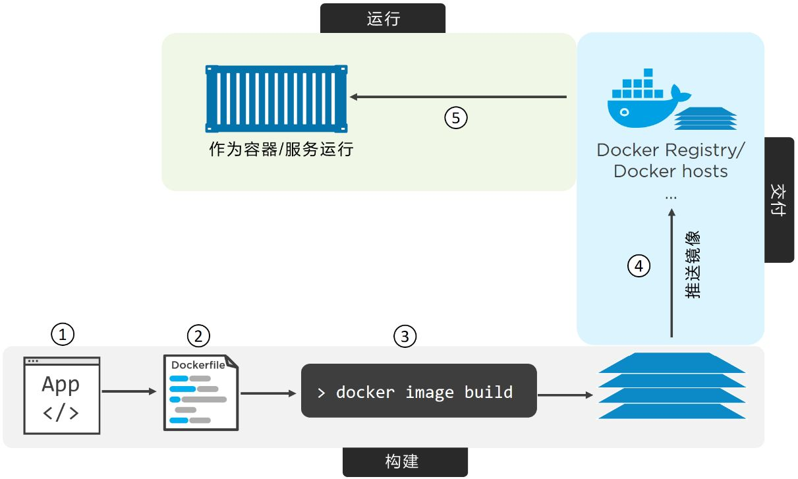
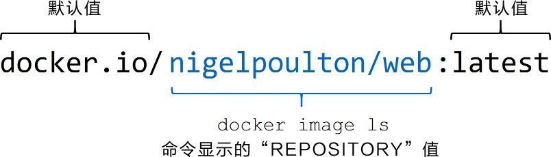

# 深入浅出 Docker

## 应用的容器化

### 步骤



1. 编写代码

2. 编写 Dockerfile
```dockerfile
FROM alpine
LABEL maintainer="nigelpoulton@hotmail.com"
RUN apk add --update nodejs nodejs-npm
COPY . /src # 将当前目录拷贝到镜像的 src 目录
WORKDIR /src
RUN npm install
EXPOSE 8080
ENTRYPOINT ["node", "./app.js"]
```

3. 构建镜像
```bash
# 在包含 Dockerfile 和应用代码的目录执行
docker image build -t web:latest .
```

4. 推送镜像到仓库
```bash
# 登录 Docker Hub
docker login
# 为镜像打标签
# docker image tag <current-tag> <new-tag>
# 为指定的镜像添加一个额外的标签，并且不覆盖已经存在的标签
docker image tag web:latest myyppp/web:latest
# 推送到 Docker Hub
docker image push myyppp/web:latest
```



5. 查看构建镜像过程中执行的指令
```bash
docker image history web:latest
```

### 多阶段构建

多阶段构建方式使用一个 Dockerfile，其中包含多个 FROM 指令。每一个 FROM 指令都是一个新的构建阶段（Build Stage），并且可以方便地复制之前阶段的构件。

```dockerfile
FROM node:latest AS storefront
WORKDIR /usr/src/atsea/app/react-app
COPY react-app .
RUN npm install
RUN npm run build

FROM maven:latest AS appserver
WORKDIR /usr/src/atsea
COPY pom.xml .
RUN mvn -B -f pom.xml -s /usr/share/maven/ref/settings-docker.xml dependency
\:resolve
COPY . .
RUN mvn -B -s /usr/share/maven/ref/settings-docker.xml package -DskipTests

FROM java:8-jdk-alpine AS production
RUN adduser -Dh /home/gordon gordon
WORKDIR /static
COPY --from=storefront /usr/src/atsea/app/react-app/build/ .
WORKDIR /app
COPY --from=appserver /usr/src/atsea/target/AtSea-0.0.1-SNAPSHOT.jar .
ENTRYPOINT ["java", "-jar", "/app/AtSea-0.0.1-SNAPSHOT.jar"]
CMD ["--spring.profiles.active=postgres"]
```

Dockerfile 中有 3 个 FROM 指令。每一个 FROM 指令构成一个单独的构建阶段。

重点在于 COPY --from 指令，它从之前的阶段构建的镜像中仅复制生产环境相关的应用代码，而不会复制生产环境不需要的构件。


### 最佳实践

1. 利用缓存构建

一旦有指令在缓存中未命中（没有该指令对应的镜像层），则后续的整个构建过程将不再使用缓存。在编写 Dockerfile 时须特别注意这一点，尽量将易于发生变化的指令置于 Dockerfile 文件的后方执行。

Docker 会计算每一个被复制文件的 Checksum 值，并与缓存镜像层中同一文件的 checksum 进行对比。如果不匹配，那么就认为缓存无效并构建新的镜像层。

通过对 docker image build 命令加入 --nocache=true 参数可以强制忽略对缓存的使用。

2. 合并镜像（利弊参半）

当创建一个新的基础镜像，以便基于它来构建其他镜像的时候，这个基础镜像就最好被合并为一层。

执行 docker image build 命令时，可以通过增加 --squash 参数来创建一个合并的镜像。

3. 使用 `no-install-recommends`

在构建 Linux 镜像时，若使用的是 APT 包管理器，则应该在执行 apt-get install 命令时增加 no-install-recommends 参数。这能够确保 APT 仅安装核心依赖（Depends 中定义）包，而不是推荐和建议的包。这样能够显著减少不必要包的下载数量。


## Dokcer Compose

Docker Compose 默认使用文件名 docker-compose.yml。当然，用户也可以使用 -f 参数指定具体文件。

```yaml
# version 定义 Compose 文件格式（主要是 API）的版本
version: "3.5"
# services 用于定义不同的应用服务
services:
  # 容器名字
  web-fe:
    # 基于当前目录（.）下 Dockerfile 中定义的指令来构建一个新镜像
    build: .
    command: python app.py
    # 将容器内（-target）的 5000 端口映射到主机（published）的 5000 端口
    ports:
      - target: 5000
        published: 5000
    # 将服务连接到指定的网络上，这个网络应该是已经存在的，或者是在 networks 一级 key 中定义的网络
    networks:
      - counter-net
      # 将 counter-vol 卷（source:）挂载到容器内的 / code（target:）
    volumes:
      - type: volume
        source: counter-vol
        target: /code
  redis:
    image: "redis:alpine"
    # 由于两个服务都连接到 counter-net 网络，因此它们可以通过名称解析到对方的地址
    networks:
      counter-net:

# networks 用于指引 Docker 创建新的网络
# 默认情况下 Docker Compose 会创建 bridge 网络
networks:
  counter-net:

# volumes 用于指引 Docker 来创建新的卷
volumes:
  counter-vol:
```

Docker Compose 会使用目录名（counter-app）作为项目名称，并将所有的资源名称中加上前缀 counter-app_。

1. 启动应用
```bash
# -d 后台启动应用
# & 将终端窗口返回，所有日志会直接输出到我们后续可能会用的终端窗口上
docker-compose up &
```

2. 相关操作
```bash
# 停止应用，删除资源
docker-compose down
# 停止应用，不删除资源
docker-compose stop
# 删除应用相关的容器和网络，但是不会删除卷和镜像
docker-compose rm
docker-compose restart
```

3. 查看应用的状态
```bash
docker-compose ps
```

4. 列出各个服务（容器）内运行的进程
```bash
docker-compose top
# 其中 PID 编号是在 Docker 主机上（而不是容器内）的进程 ID
```

## 卷与持久化数据

```bash
docker service create \
  --name hellcat \
  --mount source=bizvol,target=/vol \
  alpine
```

- docker volume create 命令用于创建新卷。默认情况下，新卷创建使用 local 驱动，但是可以通过 -d 参数来指定不同的驱动。
- docker volume ls 会列出本地 Docker 主机上的全部卷。
- docker volume inspect 用于查看卷的详细信息。可以使用该命令查看卷在 Docker 主机文件系统中的具体位置。
- docker volume prune 会删除未被容器或者服务副本使用的全部卷。谨慎使用！
- docker volume rm 删除未被使用的指定卷。

