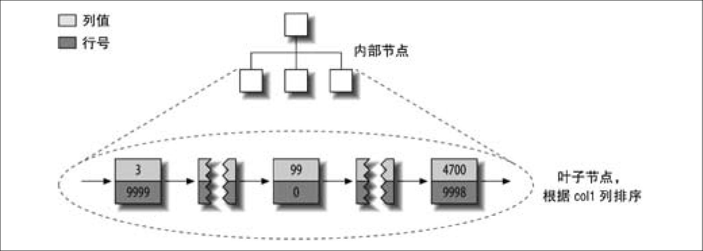
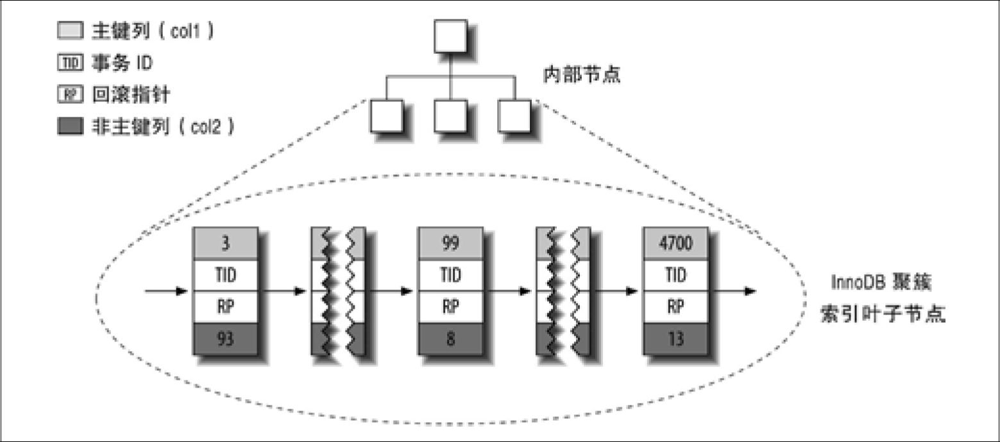

# 高性能 MySQL

## 4 Schema 与数据类型优化

### 4.1 选择优化的数据类型

#### 4.1.3 字符串类型

varchar：
- 用于存储变长的字符串，比定长类型更节省时间，它仅使用必要的空间。
- 需要使用 1 或 2 个额外字节记录字符串的长度：如果列的最大长度小于或等于 255 字节，则只使用 1 个字节表示，否则使用 2 个字节。假设采用 latin1 字符集，一个 VARCHAR(100) 的列需要 11 个字节的存储空间。VARCHAR(1000) 的列则需要 1002 个字节，因为需要 2 个字节存储长度信息。
- 由于行的变长的，在 UPDATE 时可能使行变得比原来更长。如果一个行占用的空间增长，并且在页内没有更多的空间可以存储，MyISAM 会将行拆成不同的片段存储，InnoDB 则需要分裂页来使行可以放进页内。
- InnoDB 可以把过长的 VARCHAR 存储为 BLOB。
- MySQL 在存储和检索时会保留末尾空格。
- 适用情况：
	- 字符串列的最大长度比平均长度大很多；
	- 列的更新很少，所以碎片不是问题；
	- 使用了像 UTF-8 这样复杂的字符集，每个字符都使用不同的字节数进行存储。

char：
- CHAR 适合存储很短的字符串，或者所有值都接近同一个长度。例如，CHAR 非常适合存储密码的 MD5 值，因为这是一个定长的值。
- 对于经常变更的数据，CHAR 也比 VARCHAR 更好，因为定长的 CHAR 类型不容易产生碎片。
- 对于非常短的列，CHAR 比 VARCHAR 在存储空间上也更有效率。例如用 CHAR(1) 来存储只有 Y 和 N 的值，如果采用单字节字符集只需要一个字节，但是 VARCHAR(1) 却需要两个字节，因为还有一个记录长度的额外字节。
- 当存储 CHAR 值时，MySQL 会删除所有的末尾空格。

## 5 创建高性能的索引

### 5.1 索引基础

在 MySQL 中，索引是在存储引擎层而不是服务器层实现的。

#### B+Tree 索引

- MyISAM 使用前缀压缩技术使得索引更小，而 InnoDB 则按照原数据格式进行存储。
- MyISAM 索引通过`数据的物理位置`引用被索引的行，而 InnoDB 则根据`主键`引用被索引的行。
- B+Tree 索引能够加快访问数据的速度，因为存储引擎`不再需要进行全表扫描`来获取需要的数据，取而代之的是从索引的根节点开始进行搜索。根节点的槽中存放了指向子节点的指针，存储引擎根据这些指针向下层查找。通过比较节点页的值和要查找的值可以找到合适的指针进入下层子节点，这些指针实际上定义了子节点页中值的上限和下限。最终存储引擎要么是找到对应的值，要么该记录不存在。
- 叶子节点的指针指向的是`被索引的数据`，而不是其他的节点页。
- B+Tree 对索引列是`顺序组织存储`的，所以很适合查找范围数据。

B+Tree 索引适用的的查询类型：
- 全值匹配
- 匹配最左前缀：例如只使用索引的第一列。
- 匹配列前缀：只匹配某一列的值的开头部分。
- 匹配范围值：例如查找 Allen 和 Barrymore 之间的人，这里也只使用了索引的第一列。
- 精确匹配某一列并范围匹配另外一列
- 只访问索引的查询：即查询只需要访问索引，而无需访问数据行。
- 用于查询中的 ORDER BY 操作（按顺序查找）：索引树中的节点是有序的。

限制：
- 如果不是按照索引的最左列开始查找，则无法使用索引。
- 不能跳过索引中的列。
- 如果查询中有某个列的范围查询，则其右边所有列都无法使用索引优化查找。如果范围查询列`值的数量有限`，那么可以通过使用多个等于条件来代替范围条件。

#### 哈希索引

哈希索引（hash index）基于哈希表实现，只有精确匹配索引所有列的查询才有效。对于每一行数据，存储引擎都会对所有的索引列计算一个哈希码（hash code）。哈希索引将所有的哈希码存储在索引中，同时在哈希表中保存指向每个数据行的指针。

限制：
- 哈希索引只包含`哈希值`和`行指针`，而不存储字段值，所以不能使用索引中的值来避免读取行。
- 哈希索引数据并不是按照索引值顺序存储的，所以也就无法用于排序。
- 哈希索引也不支持部分索引列匹配查找，因为哈希索引始终是使用索引列的全部内容来计算哈希值的。
- 哈希索引`只支持等值比较查询`，包括 =、IN()、<=>（注意 <> 和 <=> 是不同的操作）。也不支持任何范围查询，例如 WHERE price > 100。
- 访问哈希索引的数据非常快，除非有很多哈希冲突（不同的索引列值却有相同的哈希值）。当出现哈希冲突的时候，存储引擎必须遍历链表中所有的行指针，逐行进行比较，直到找到所有符合条件的行。
- 如果哈希冲突很多的话，一些索引维护操作的代价也会很高。例如，如果在某个选择性很低（哈希冲突很多）的列上建立哈希索引，那么当从表中删除一行时，存储引擎需要遍历对应哈希值的链表中的每一行，找到并删除对应行的引用，冲突越多，代价越大。

### 5.2 索引的优点

优点：
- 索引大大减少了服务器需要扫描的数据量。
- 索引可以帮助服务器避免排序和临时表（这是由于 B-tree 索引顺序存储的特性）。
- 索引可以将随机 I/O 变为顺序 I/O（虽然数据可能是随机存储的，但是 B-tree 索引顺序存储的）。

三星系统：
- 索引将相关的记录放到一起。
- 索引中的数据顺序和查找中的排列顺序一致。
- 索引中的列包含了查询中需要的全部列。

### 5.3 高性能的索引策略

#### 1. 独立的列

独立的列：指索引列不能是表达式的一部分，也不能是函数的参数。

#### 2. 前缀索引和索引选择性

> [!note|label:索引的选择性]
>
> 不重复的索引值（也称为基数，cardinality）和数据表的记录总数（#T）的比值，范围从 1/#T 到 1 之间。
> 
> 索引的选择性越高则查询效率越高，因为选择性高的索引可以让 MySQL 在查找时过滤掉更多的行。唯一索引的选择性是 1，这是最好的索引选择性，性能也是最好的。

MySQL 无法使用前缀索引做 ORDER BY 和 GROUP BY，也无法使用前缀索引做覆盖扫描。

#### 3. 多列索引

#### 4. 选择合适的索引列顺序

#### 5. 聚簇索引

聚簇索引是一种`数据存储`方式，InnoDB 的聚簇索引实际上在同一个结构中保存了 B-Tree `索引和数据行`。

当表有聚簇索引时，它的数据行存放在索引的`叶子页`中。因为无法把数据行存放在两个不同的地方，所以一个表只能有一个聚簇索引。

叶子页包含了行的全部数据，节点页只包含了索引列。

InnoDB 将通过主键聚集数据，如果没有定义主键，InnoDB 会选择一个唯一的非空索引代替。如果没有这样的索引，InnoDB 会隐式定义一个主键来作为聚簇索引。InnoDB 只聚集在同一个页面中的记录。包含相邻键值的页面可能会相距甚远。

优点：
- 可以把`相关数据保存在一起`。例如实现电子邮箱时，可以根据用户 ID 来聚集数据，这样只需要从磁盘读取少数的数据页就能获取某个用户的全部邮件。如果没有使用聚簇索引，则每封邮件都可能导致一次磁盘 I/O。
- 数据访问更快。聚簇索引将索引和数据保存在同一个 B-Tree 中，因此从聚簇索引中获取数据通常比在非聚簇索引中查找要快。
- 使用覆盖索引扫描的查询可以直接使用页节点中的主键值。

缺点：
- 聚簇数据最大限度地提高了 I/O 密集型应用的性能，但如果数据全部都放在内存中，则访问的顺序就没那么重要了，聚簇索引也就没什么优势了。
- 插入速度严重依赖于插入顺序。按照`主键的顺序插入`是加载数据到 InnoDB 表中速度最快的方式。但如果不是按照主键顺序加载数据，那么在加载完成后最好使用 OPTIMIZE TABLE 命令重新组织一下表。
- 更新聚簇索引列的代价很高，因为会强制 InnoDB 将每个被更新的行移动到新的位置。
- 基于聚簇索引的表在插入新行，或者主键被更新导致需要移动行的时候，可能面临`页分裂（page split）`的问题。当行的主键值要求必须将这一行插入到某个已满的页中时，存储引擎会将该页分裂成两个页面来容纳该行，这就是一次页分裂操作。页分裂会导致表占用更多的磁盘空间。
- 聚簇索引可能导致全表扫描变慢，尤其是行比较稀疏，或者由于页分裂导致数据存储不连续的时候。
- 二级索引（非聚簇索引）可能比想象的要更大，因为在二级索引的叶子节点包含了引用行的主键列。
- 二级索引访问需要两次索引查找，而不是一次。

MyISAM 的数据分布：

MyISAM 的主键分布：

MyISAM 的索引文件仅仅保存数据记录的地址。在 MyISAM 中，主索引和辅助索引（Secondary key）在结构上没有任何区别，只是主索引要求 key 是唯一的，而辅助索引的 key 可以重复。

因此，MyISAM 中索引检索的算法为首先按照 B+Tree 搜索算法`搜索索引`，如果指定的 key 存在，则取出其 data 域的值，然后以 data 域的值为`地址`，读取相应`数据记录`。

MyISAM 的索引是非聚簇索引的，MyISAM `索引`文件和`数据`文件是分离的，因为它的数据不是跟索引聚集在一起，而 InnoDB 是聚簇索引。

InnoDB 的数据分布：

聚簇索引的每一个叶子节点都包含了主键值、事务 ID、用于事务和 MVCC 的回滚指针以及所有的剩余列。如果主键是一个列前缀索引，InnoDB 也会包含完整的主键列和剩下的其他列。

InnoDB `二级索引的叶子节点`中存储的不是行指针，而是`主键值`。这样的策略减少了当出现行移动或者数据页分裂时二级索引的维护工作。使用主键值当作指针会让二级索引占用更多的空间，换来的好处是，InnoDB 在移动行时无须更新二级索引中的这个指针。

最好避免随机的（不连续且值的分布范围非常大）聚簇索引，特别是对于 I/O 密集型的应用。例如，从性能的角度考虑，使用 UUID 来作为聚簇索引则会很糟糕：它使得聚簇索引的插入变得完全随机，这是最坏的情况，使得数据没有任何聚集特性。

UUID 来作为聚簇索引缺点：
- 写入的目标页可能已经刷到磁盘上并从缓存中移除，或者是还没有被加载到缓存中，InnoDB 在插入之前不得不先找到并从磁盘读取目标页到内存中。这将导致大量的`随机 I/O`。
- 因为`写入是乱序`的，InnoDB 不得不频繁地做`页分裂`操作，以便为新的行分配空间。页分裂会导致移动大量数据，一次插入最少需要修改三个页而不是一个页。
- 由于频繁的页分裂，页会变得`稀疏`并被不规则地填充，所以最终数据会有碎片。

顺序的主键什么时候会造成更坏的结果？
- 对于高并发工作负载，在 InnoDB 中按主键顺序插入可能会造成明显的争用。主键的上界会成为「热点」。因为所有的插入都发生在这里，所以并发插入可能导致间隙锁竞争。
- 另一个热点可能是 AUTO_INCREMENT 锁机制；如果遇到这个问题，则可能需要考虑重新设计表或者应用，或者更改 innodb_autoinc_lock_mode 配置。

#### 6. 覆盖索引

> [!note|label:覆盖索引]
> 
> 可以使用 B-tree 直接获取我们所需数据的一种方法，B-tree 索引在叶子节点上存储了关键字的值，故我们可以通过索引关键字直接获取所需查询的数据，这样也就没必要读取数据行的信息了，这种`包含了所有查询字段全部值`的索引就叫覆盖索引。这里的全部值包括 select 语句中的字段，where 子句中的字段和 orderby，group by 子句中的字段。

查询只需要扫描索引而无须回表的优点：
- 可以`优化缓存`，减少磁盘 I/O 操作。索引条目通常远小于数据行大小，所以如果只需要读取索引，那 MySQL 就会极大地减少数据访问量。这对缓存的负载非常重要，因为这种情况下响应时间大部分花费在数据拷贝上。覆盖索引对于 I/O 密集型的应用也有帮助，因为索引比数据更小，更容易全部放入内存中。
- 可以`减少随机 I/O`，变随机 I/O 为顺序 I/O。因为索引是按照列值顺序存储的，所以对于 I/O 密集型的范围查询会比随机从磁盘读取每一行数据的 I/O 要少得多。对于某些存储引擎，例如 MyISAM 和 Percona XtraDB，甚至可以通过 OPTIMIZE 命令使得索引完全顺序排列，这让简单的范围查询能使用完全顺序的索引访问。
- 可以避免 MyISAM 表进行系统调用。一些存储引擎如 MyISAM 在内存中只缓存索引，数据则依赖于操作系统来缓存，因此要访问数据需要一次系统调用。这可能会导致严重的性能问题，尤其是那些系统调用占了数据访问中的最大开销的场景。
- 可以避免对 InnoDB 主键索引的`二次查询`。由于 InnoDB 的聚簇索引，覆盖索引对 InnoDB 表特别有用。InnoDB 的二级索引在叶子节点中保存了行的主键值，所以如果二级主键能够覆盖查询，则可以避免对主键索引的二次查询。

#### 7. 使用索引扫描来做排序

优化：
- 只有当索引的列顺序和 ORDER BY 子句的顺序完全一致，并且所有列的排序方向（倒序或正序）都一样时，MySQL 才能够使用索引来对结果做排序。
- 如果查询需要关联多张表，则只有当 ORDER BY 子句引用的字段全部为第一个表时，才能使用索引做排序。
- ORDER BY 子句和`查找型查询`的限制是一样的：需要满足索引的最左前缀的要求；否则，MySQL 都需要执行排序操作，而无法利用索引排序。

有一种情况下 ORDER BY 子句可以不满足索引的最左前缀的要求，就是前导列为常量的时候。

#### 8. 压缩（前缀压缩）索引

#### 9. 冗余和重复索引

MySQL 的唯一限制和主键限制都是通过索引实现的。

加新索引将会导致 INSERT、UPDATE、DELETE 等操作的速度变慢，特别是当新增索引后导致达到了内存瓶颈的时候。

#### 10. 未使用的索引

#### 11. 索引和锁

索引可以让查询锁定更少的行。如果你的查询从不访问那些不需要的行，那么就会`锁定更少的行`，从两个方面来看这对性能都有好处。首先，虽然 InnoDB 的行锁效率很高，内存使用也很少，但是锁定行的时候仍然会带来额外开销；其次，锁定超过需要的行会增加锁争用并减少并发性。

InnoDB 只有在访问行的时候才会对其加锁，而索引能够减少 InnoDB 访问的行数，从而减少锁的数量。但这只有当 InnoDB 在存储引擎层能够过滤掉所有不需要的行时才有效。如果索引无法过滤掉无效的行，那么在 InnoDB 检索到数据并返回给服务器层以后，MySQL 服务器才能应用 WHERE 子句。这时已经无法避免锁定行了：InnoDB 已经锁住了这些行，到适当的时候才释放。

## 补充概念

#### 回表

InnoDB 的聚簇索引的叶子结点上存取着具体的主键索引和数据，如果通过其他`二级索引`想要获取数据时，索引覆盖的列不能满足需求，那么就需要再去查询主键索引，这种现象就称之为回表。

#### 索引下推

索引下推是数据库检索数据过程中`为减少回表次数`而做的优化。索引条件下推优化可以减少存储引擎查询基础表的次数，也可以减少 MySQL 服务器从存储引擎接收数据的次数。

在不使用索引条件下的情况下，在使用非主键索引（二级索引）进行查询时，存储引擎通过索引检索到数据，然后返回给 MySQL 服务器，服务器然后判断数据是否符合条件。在使用索引条件下推的情况下，如果存在某些`被索引的列`的判断条件时，MySQL 服务器将这一部分判断条件传递给存储引擎，然后由存储引擎通过判断索引是否符合 MySQL 服务器传递的条件，只有当索引符合条件时才会将数据检索出来返回给 MySQL 服务器。

InnoDB 引擎的表，索引下推只能用于二级索引。索引下推一般可用于所求查询字段 (select 列) 不是 / 不全是联合索引的字段，查询条件为多条件查询且查询条件子句 (where/order by) 字段全是联合索引。
