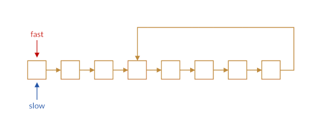
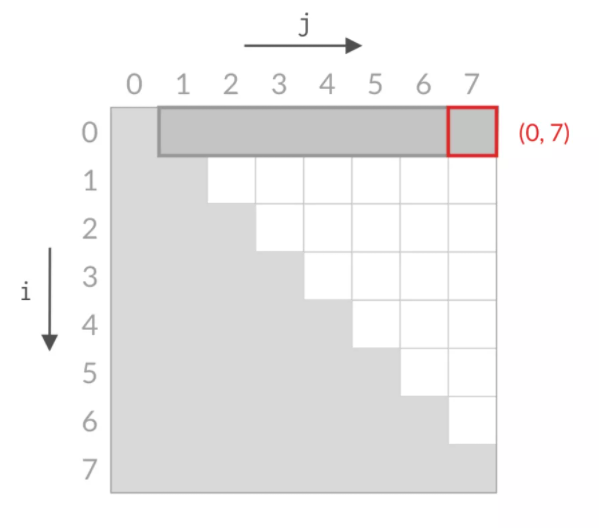
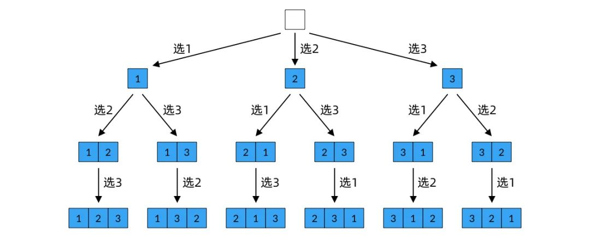
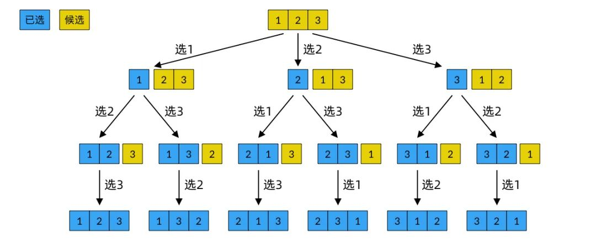
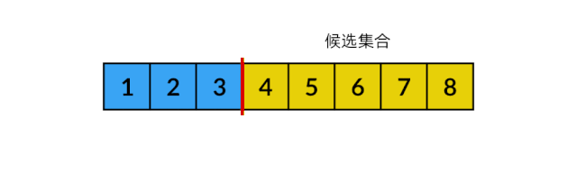
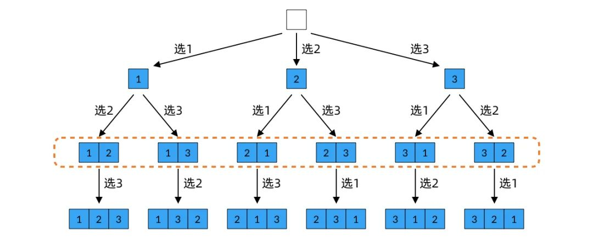
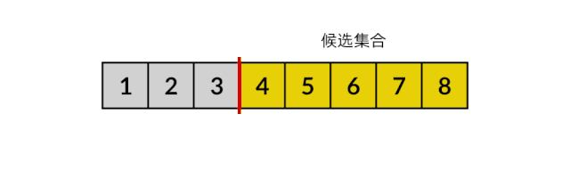
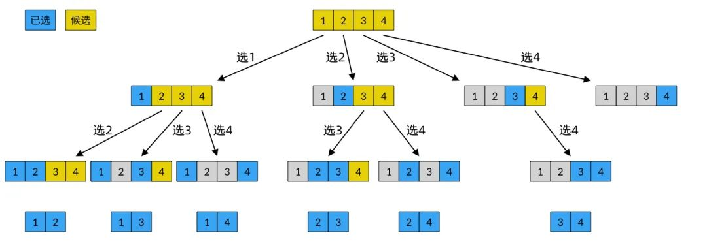
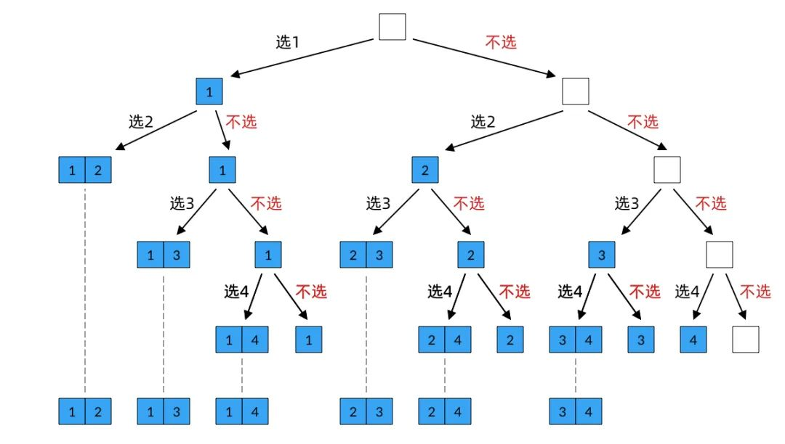
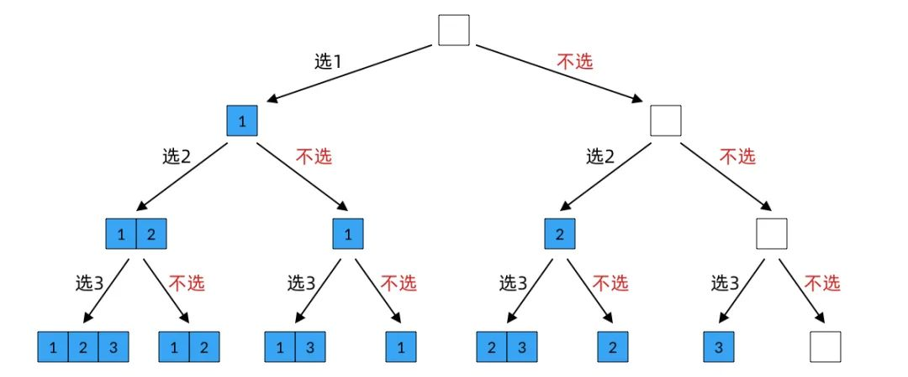

# 常见解题思路

## 滚动数组


```go
func tribonacci(n int) int {
    if n == 0 {
        return 0
    }
    if n <= 2 {
        return 1
    }
    p, q, r, s := 0, 0, 1, 1
    for i := 3; i <= n; i++ {
        p = q
        q = r
        r = s
        s = p + q + r
    }
    return s
}
```

## 双指针

### 1. 快慢指针

- 寻找链表中点
- 寻找链表的倒数第 k 个元素
- 判断链表中是否存在环



### 2. 同向指针

### 3. 对向指针

- 有序数组的两数之和
- 盛水最多的容器

本质：`缩减搜索空间`



### 4. 滑动窗口

```java
/* 滑动窗口算法框架 */
void slidingWindow(string s, string t) {
    unordered_map<char, int> need, window;
    for (char c : t) need[c]++;

    int left = 0, right = 0;
    int valid = 0;
    while (right < s.size()) {
        // c 是将移入窗口的字符
        char c = s[right];
        // 增大窗口
        right++;
        // 进行窗口内数据的一系列更新
        ...

        /*** debug 输出的位置 ***/
        printf("window: [%d, %d)\n", left, right);
        /********************/

        // 判断左侧窗口是否要收缩
        while (window needs shrink) {
            // d 是将移出窗口的字符
            char d = s[left];
            // 缩小窗口
            left++;
            // 进行窗口内数据的一系列更新
            ...
        }
    }
}
```

## 单链表

虚拟头节点

```go
dummy := &ListNode{Val: -1}
head := dummy
```


## 二分查找

1. [力扣 704 题](https://leetcode-cn.com/problems/binary-search/)

升序数组中返回目标元素的下标，否则返回 -1
```go
func search(nums []int, target int) int {
	left, right := 0, len(nums)-1
	for left <= right {
		mid := left + (right-left)/2
		switch {
		case nums[mid] < target:
			left = mid + 1
		case nums[mid] == target:
			return mid
		case nums[mid] > target:
			right = mid - 1
		}
	}
	return -1
}
```

2. [力扣 35 题](https://leetcode-cn.com/problems/search-insert-position/)

升序数组中返回目标元素的下标，否则返回按顺序插入位置
```go
func searchInsert(nums []int, target int) int {
	left, right := 0, len(nums)-1
	for left <= right {
		mid := left + (right-left)/2
		switch {
		case nums[mid] < target:
			left = mid + 1
		default:
			right = mid - 1
		}
	}
	return left
}
```

3. [力扣 34 题](https://leetcode-cn.com/problems/find-first-and-last-position-of-element-in-sorted-array/)

在排序数组中查找元素的第一个和最后一个位置

搜索左侧边界
```go
func searchLeft(nums []int, target int) int {
	left, right := 0, len(nums)-1
	for left <= right {
		mid := left + (right-left)/2
		switch {
		case nums[mid] < target:
			left = mid + 1
		default:
			right = mid - 1
		}
	}
	if left == len(nums) || nums[left] != target {
		return -1
	}
	return left
}
```

搜索右侧边界
```go
func searchRight(nums []int, target int) int {
	left, right := 0, len(nums)-1
	for left <= right {
		mid := left + (right-left)/2
		switch {
		case nums[mid] > target:
			right = mid - 1
		default:
			left = mid + 1
		}
	}
	if right == -1 || nums[right] != target {
		return -1
	}
	return right
}
```

## 动态规划

1. 定义子问题
	1. 原问题要能用子问题表示
	2. 一个子问题的解要能通过其他子问题的解求出
2. 子问题的递推公式
3. 确定 dp 数组的计算顺序
4. 空间优化


## 回溯

1. 已选集
2. 候选集
3. 结束条件（到达决策树底层）

### 全排列 P(n, n)

决策树的分支数量不固定，一共做 n 次决策，第 i 次决策选择排列的第 i 个数，选择第 1 个数时，全部的 n 个数都可供挑选。由于不可重复选择，越往后可供选择的数越少。



每做一次选择，候选集就少一个元素，直到候选集选完为止。



已选集与候选集为候补关系，使用一个 current 数组，左半表示已选元素，右半表示候选元素。




```go
// 全排列
func pnn(nums []int) [][]int {
	res := [][]int{}
	// current[0, k) 已选集合
	// current[k, N) 候选集和
	// 对第 k 个元素做抉择
	var backtrack func(current []int, k int)
	backtrack = func(current []int, k int) {
		if k == len(current) {
			res = append(res, append([]int{}, current...))
			return
		}
		// 从候选集合中选择
		for i := k; i < len(current); i++ {
			// 选择数字 current[i]
			current[i], current[k] = current[k], current[i]
			// k+1
			backtrack(current, k+1)
			// 撤销选择
			current[i], current[k] = current[k], current[i]
		}
	}
	current := nums
	backtrack(current, 0)
	return res
}
```

### 排列 P(n, k)（n 中取 k）

在全排列的基础上，做完第 k 个决策就将结果返回。



```go
// n 中取 k 的排列
func pnk(nums []int, m int) [][]int {
	res := [][]int{}
	// current[0, k) 已选集合
	// current[k, N) 候选集和
	// 对第 k 个元素做抉择
	var backtrack func(current []int, k int)
	backtrack = func(current []int, k int) {
		// 当已选集合达到 m 个元素时，收集结果并停止选择
		if k == m {
			res = append(res, append([]int{}, current[:m]...))
			return
		}
		for i := k; i < len(current); i++ {
			current[i], current[k] = current[k], current[i]
			backtrack(current, k+1)
			current[i], current[k] = current[k], current[i]
		}
	}
	current := nums
	backtrack(current, 0)
	return res
}
```

### 组合 C(n, k)

与排列的区别：元素相同，顺序不同的两个结果视为不同的排列，但视为同一组合。

#### 解 1

只考虑升序的结果，每当选择了一个数 x 时，将候选集合中所有小于 x 的元素删除，不再作为候选元素。

只用一个指针表示新的候选集。



候选集合均为连续的，另开一个数组保存已选元素。



```go
// 组合
// 元素相同，顺序不同
// 视为不同结果为排列，视为相同结果为组合
// 只选择升序作为结果
// 当选择了 x，不再选择小于 x 的元素
func cnk(nums []int, m int) [][]int {
	res := [][]int{}
	// current 已选集合
	// nums[k, N) 候选集合
	var backtrack func(current []int, k int)
	backtrack = func(current []int, k int) {
		if len(current) == m {
			res = append(res, append([]int{}, current...))
			return
		}
		for i := k; i < len(nums); i++ {
			// 选择数字 nums[i]
			current = append(current, nums[i])
			// 元素 nums[k, i) 均失效
			backtrack(current, i+1)
			// 撤销
			current = current[:len(current)-1]
		}
	}
	// 由于已选集合与候选集合并非互补，使用单独的数组存储已选元素
	backtrack([]int{}, 0)
	return res
}
```

#### 解 2

从 n 中选择 k 个数的组合，实际上就是求 n 个元素的所有大小为 k 的子集。当已选集合大小为 k 时，不再递归。



```go
// 组合 2 使用子集方法
func cnk2(nums []int, m int) [][]int {
	res := [][]int{}
	var backtrack func(current []int, k int)
	backtrack = func(current []int, k int) {
		if len(current) == m {
			res = append(res, append([]int{}, current...))
			return
		}
		if k == len(nums) { // 递归树到达最后一行
			return
		}
		// 不选择第 k 个元素
		backtrack(current, k+1)

		// 回溯
		// 选择第 k 个元素
		current = append(current, nums[k])
		backtrack(current, k+1)
		current = current[:len(current)-1]
	}
	backtrack([]int{}, 0)
	return res
}
```

### 子集

#### 解 1

回溯



```go
func subsets(nums []int) [][]int {
	res := [][]int{}
	var backtrack func(current []int, k int)
	backtrack = func(current []int, k int) {
		if k == len(nums) {
			res = append(res, append([]int{}, current...))
			return
		}
		// 不选择第 k 个元素
		backtrack(current, k+1)

		// 回溯
		// 选择第 k 个元素
		current = append(current, nums[k])
		backtrack(current, k+1)
		current = current[:len(current)-1]
	}
	backtrack([]int{}, 0)
	return res
}
```

#### 解 2

```go
// 2 的 N 次方个子集
// 2^n = C(0, n) + C(1, n) + ... + C(n, n)
func subsets(nums []int) [][]int {
	res := [][]int{}
	// current 是已选集合
	// nums[k, N) 为候选集合
	var backtrack func(current []int, k int)
	backtrack = func(current []int, k int) {
		// 收集决策树上每一个节点的结果
		res = append(res, append([]int{}, current...))
		// 候选集合为空时，停止递归
		if k == len(nums) {
			return
		}
		// 从候选集合中选择
		for i := k; i < len(nums); i++ {
			// 选择
			current = append(current, nums[i])
			// 元素 [m, i) 均失效
			backtrack(current, i+1)
			// 撤销
			current = current[:len(current)-1]
		}
	}
	backtrack([]int{}, 0)
	return res
}
```
