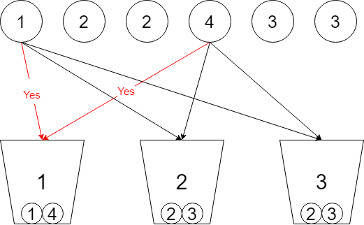
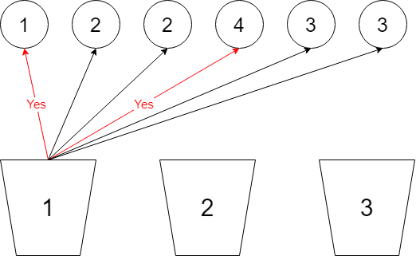

# 集合划分

划分为k个相等子集：https://leetcode.cn/problems/partition-to-k-equal-sum-subsets/

## 回溯

### 1. 球视角（每个球选择 k 个桶）



剪支：
- 如果当前桶的和大于target，则放入下一个桶中；
- 如果当前桶和前面桶一样，则跳过当前桶；

```go
func canPartitionKSubsets(nums []int, k int) bool {
	sum := 0
	for _, v := range nums {
		sum += v
	}
	if sum%k != 0 {
		return false
	}

	sort.Sort(sort.Reverse(sort.IntSlice(nums)))
	bucket := make([]int, k)
	res := false
	// 每个球选择 k 个桶
	// 决策树：第 i 层代表第 i 个球选择 k 个桶
	// 复杂度 k^n
	var backtrack func(n int)
	backtrack = func(n int) {
		// 结束条件，n 个球均已做完选择
		if n == len(nums) {
			res = true
			return
		}
	next:
		// 第 i 号桶
		for i := 0; i < k; i++ {
			// 剪支：当前桶和以前的桶的一样
			for j := 0; j < i; j++ {
				if bucket[j] == bucket[i] {
					continue next
				}
			}
			// 剪支
			if bucket[i]+nums[n] > sum/k {
				continue
			}
			// 选择
			bucket[i] += nums[n]
			backtrack(n + 1)
			// 撤销
			bucket[i] -= nums[n]
		}
	}
	backtrack(0)
	return res
}
```

### 2. 桶视角（桶选择 n 个球）



```go
// 桶视角，桶选择球
func canPartitionKSubsets(nums []int, k int) bool {
	sum := 0
	for _, v := range nums {
		sum += v
	}
	if sum%k != 0 {
		return false
	}

	used := 0 // 位图表示
	bucket := make([]int, k)
	memo := map[int]bool{}
	// 桶选择球
	// 复杂度 k * n^2
	// m：第 m 个桶
	// n：第 n 个数字
	var backtrack func(m, n int) bool
	backtrack = func(m, n int) bool {
		// k 个桶均已装满
		if m == k {
			return true
		}
		if bucket[m] == sum/k {
			// 装满了当前桶，下一个桶开始装
			res := backtrack(m+1, 0)
			memo[used] = res
			return res
		}

		if res, ok := memo[used]; ok {
			return res
		}

		// 第 k 个桶对每一个球选择是否装入
		for i := n; i < len(nums); i++ {
			if used&(1<<i) != 0 {
				continue
			}
			if bucket[m]+nums[i] > sum/k {
				continue
			}
			// 选择 标记已使用
			bucket[m] += nums[i]
			used |= (1 << i)
			// 当前桶 选择下一个球
			if backtrack(m, i+1) {
				return true
			}
			// 撤销选择
			bucket[m] -= nums[i]
			used &^= (1 << i)
		}
		return false
	}
	return backtrack(0, 0)
}
```

