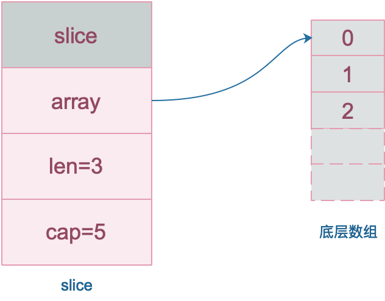
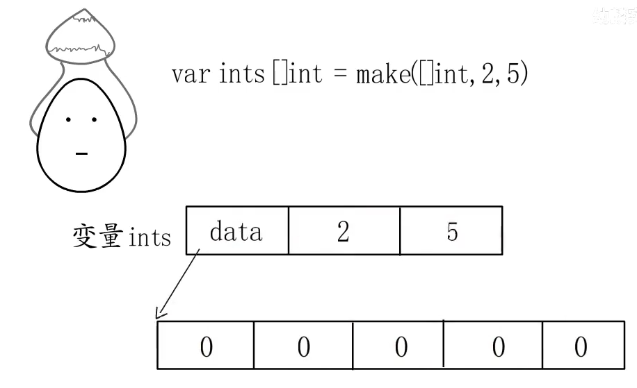
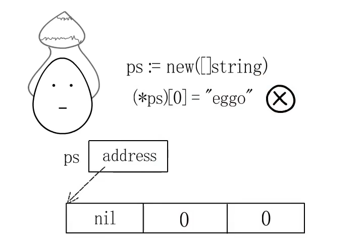
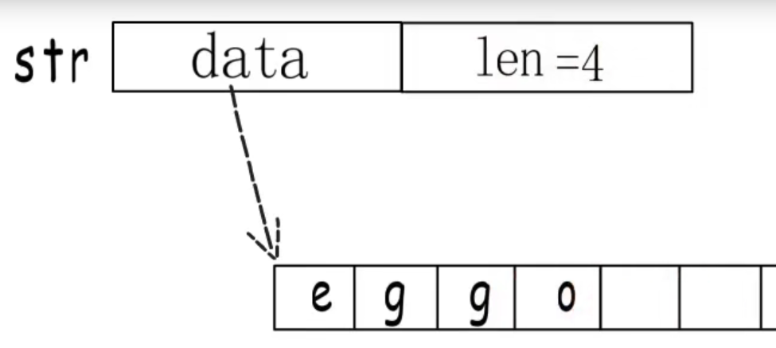
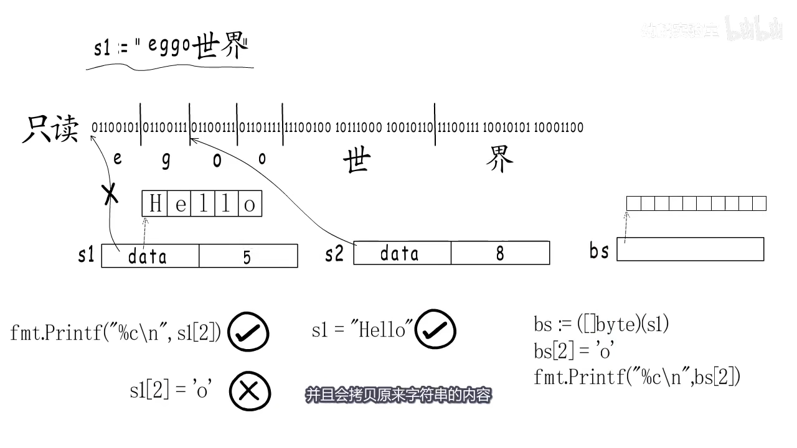

# Go 基础

## 最大最小值常量
```go
// 无符号整型 uint
// 其最小值是 0，其二进制表示的所有位都为 0
const UINT_MIN uint = 0
// 其最大值的二进制表示的所有位都为 1，那么
const UINT_MAX = ^uint(0)

// 有符号整型 int
// 根据补码，其最大值二进制表示，首位 0，其余 1
const INT_MAX = int(^uint(0) >> 1)
// 根据补码，其最小值二进制表示，首位 1，其余 0
const INT_MIN = ^INT_MAX
```

## slice

数组就是一片连续的内存，slice 实际上是一个结构体，包含三个字段：长度、容量、底层数组。
```go
// runtime/slice.go
type slice struct {
	array unsafe.Pointer // 元素指针
	len   int // 长度
	cap   int // 容量
}
```



### make 与 new 对比

`ints []int = make([]int, 2, 5)`
开辟一段内存作为底层数组， 初始化为默认值 0



`ps :=new([]string)`



### 扩容规则

1. 第一步：预估扩容后的容量。
```go
// go 1.9.5 src/runtime/slice.go:82
// 参数 et：元素的类型 old：扩容前的 slice cap：预估容量
func growslice(et *_type, old slice, cap int) slice {
	// ……
	newcap := old.cap
	doublecap := newcap + newcap
	// 容量翻倍，还是小于最小容量，那么预估容量等于最小容量
	if cap > doublecap {
		newcap = cap
	} else {
		if old.len < 1024 {
			// 扩容前元素个数小于 1024，直接翻倍
			newcap = doublecap
		} else {
			for newcap < cap {
				// 扩 1.25 倍
				newcap += newcap / 4
			}
		}
	}
	// ……

	capmem = roundupsize(uintptr(newcap) * ptrSize)
	newcap = int(capmem / ptrSize)
}
```

2. 第二步：需要多大的内存。

- `预估容量`：x 元素类型大小。
- `申请内存`：向语言实现的内存管理模块申请。
- 匹配到`合适`的内存规格：8 16 32 48 64 80 96 112。

```go
// src/runtime/msize.go:13
func roundupsize(size uintptr) uintptr {
	if size < _MaxSmallSize {
		if size <= smallSizeMax-8 {
			return uintptr(class_to_size[size_to_class8[(size+smallSizeDiv-1)/smallSizeDiv]])
		} else {
			//……
		}
	}
	//……
}

const _MaxSmallSize = 32768
const smallSizeMax = 1024
const smallSizeDiv = 8

var size_to_class8 = [smallSizeMax/smallSizeDiv + 1]uint8{0, 1, 2, 3, 3, 4, 4, 5, 5, 6, 6, 7, 7, 8, 8, 9, 9, 10, 10, 11, 11, 12, 12, 13, 13, 14, 14, 15, 15, 16, 16, 17, 17, 18, 18, 18, 18, 19, 19, 19, 19, 20, 20, 20, 20, 21, 21, 21, 21, 22, 22, 22, 22, 23, 23, 23, 23, 24, 24, 24, 24, 25, 25, 25, 25, 26, 26, 26, 26, 26, 26, 26, 26, 27, 27, 27, 27, 27, 27, 27, 27, 28, 28, 28, 28, 28, 28, 28, 28, 29, 29, 29, 29, 29, 29, 29, 29, 30, 30, 30, 30, 30, 30, 30, 30, 30, 30, 30, 30, 30, 30, 30, 30, 31, 31, 31, 31, 31, 31, 31, 31, 31, 31, 31, 31, 31, 31, 31, 31}

var class_to_size = [_NumSizeClasses]uint16{0, 8, 16, 32, 48, 64, 80, 96, 112, 128, 144, 160, 176, 192, 208, 224, 240, 256, 288, 320, 352, 384, 416, 448, 480, 512, 576, 640, 704, 768, 896, 1024, 1152, 1280, 1408, 1536, 1792, 2048, 2304, 2688, 3072, 3200, 3456, 4096, 4864, 5376, 6144, 6528, 6784, 6912, 8192, 9472, 9728, 10240, 10880, 12288, 13568, 14336, 16384, 18432, 19072, 20480, 21760, 24576, 27264, 28672, 32768}
```

`class_to_size[size_to_class8[(size+smallSizeDiv-1)/smallSizeDiv]]` 是有关内存分配的两个 slice。`class_to_size` 通过 spanClass 获取 span 划分的 object 大小。而 size_to_class8 表示通过 size 获取它的 spanClass。

示例
```go
func main() {
	s := []int{1,2}
	s = append(s,4,5,6)
	fmt.Printf("len=%d, cap=%d",len(s),cap(s)) // len=5, cap=6
}

1. 略
2.1 调用了 roundupsize 函数，传入 40。（代码中 ptrSize 是指一个指针的大小，在 64 位机上是 8）
2.2 (size+smallSizeDiv-1)/smallSizeDiv = 5
2.3 获取 size_to_class8 数组中索引为 5 的元素为 4；获取 class_to_size 中索引为 4 的元素为 48
3. newcap = int(capmem / ptrSize) // 6
```

向一个 nil 的 slice 添加元素会发生什么？
- 其实 nil slice 或者 empty slice 都是可以通过调用 append 函数来获得底层数组的扩容。最终都是调用 mallocgc 来向 Go 的内存管理器申请到一块内存，然后再赋给原来的 nil slice 或 empty slice。

## string

UTF-8 变长编码


len：字节数目



- 字符串变量可以共用底层字符串内容
- 字符串只读，不可以修改



## go mod

[官方文档](https://github.com/golang/go/wiki/Modules)

### go.mod 文件介绍

go.mod 提供了 module、require、replace 和 exclude 四个命令：
- module 语句指定包的名字（路径）
- require 语句指定的依赖项模块
- replace 语句可以替换依赖项模块
- exclude 语句可以忽略依赖项模块

版本选择规则：
1. go module 安装 package 的原则是先拉取最新的 `release tag`，若无 tag 则拉取最新的 `commit`。
2. 包版本的选择采用最小版本选择算法 (minimal version selection)。举例说明，如果 module 依赖 A 配置有 require D v1.0.0，依赖 B 配置有 require D v1.0.1，那么构建的时候会选择 v1.0.1。
3. 不会自动升级依赖的 version，保证 100% 可重复构建。

### 语义化版本

> [!note|label:语义化版本]
> [语义化版本](https://semver.org/lang/zh-CN/)
>
> 版本格式：主版本号.次版本号.修订号，版本号递增规则如下：
> - 主版本号：当你做了不兼容的 API 修改
> - 次版本号：当你做了向下兼容的功能性新增
> - 修订号：当你做了向下兼容的问题修正
> - 先行版本号及版本编译信息可以加到 "主版本号.次版本号.修订号" 的后面，作为延伸。

### 虚拟版本号

形式如：`v0.0.0-yyyymmddhhmmss-abcdefabcdef`。其中时间是提交时的 `UTC 时间 `，最后的后缀是提交的 ` 哈希值前缀 `。时间部分确保两个虚拟版本号可以进行比较，以确定两者顺序。

虚拟版本的生成不需要你去手动操作，go 命令会将接收的 `commit 哈希值 ` 自动转化为 ` 虚拟版本号 `。
1. 找到项目最后一次提交的 `commit id`。
2. 在 go mod 的 require 里面引入项目的 `last commit id`。
```go
// 由于不知道哪个版本号，那么在 require 里面使用最近一次提交的 commit id: 510aa62
require (
    git.xx.cn/rd/dnsa 510aaa62
)
```

3. 执行
```go
go mod tidy
// 执行后就会发现已经帮我们自动引入了最后一次 commit id 对应的版本号
require (
    git.xxx.cn/rd/dnsa v1.1.1-0.20190923073425-510aaa62d1d0
)
```

编辑 mod：`go mod edit -replace=old[@v]=new[@v]`

