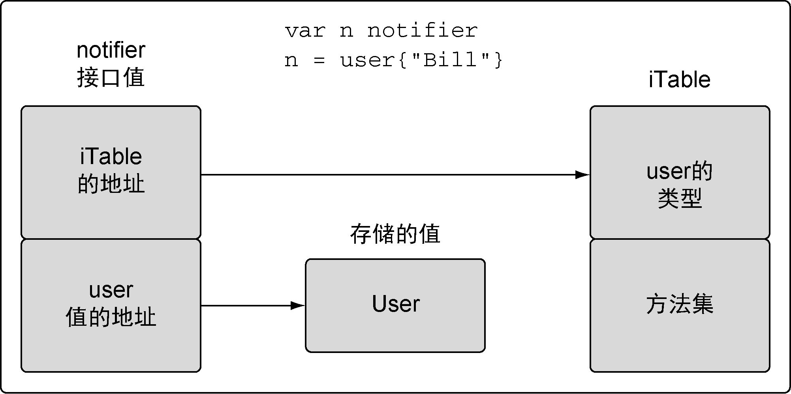
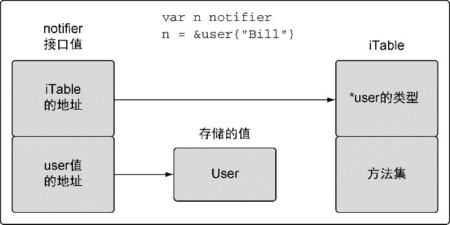
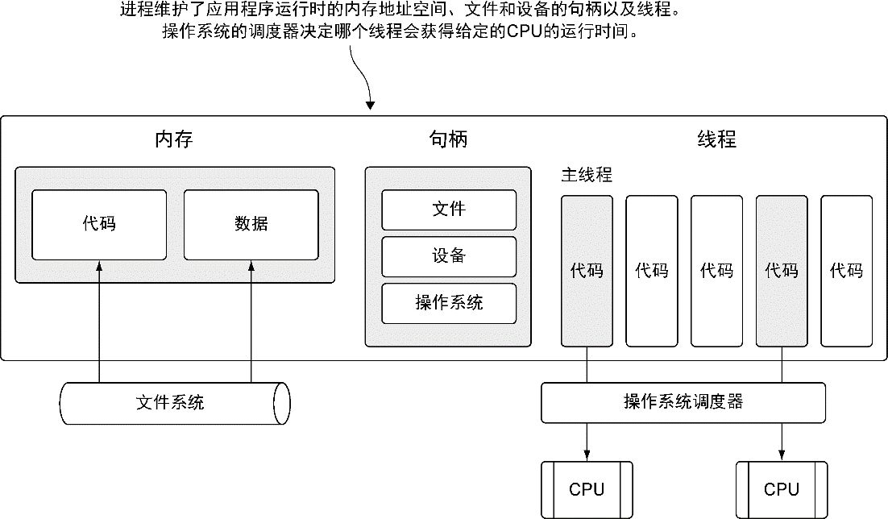
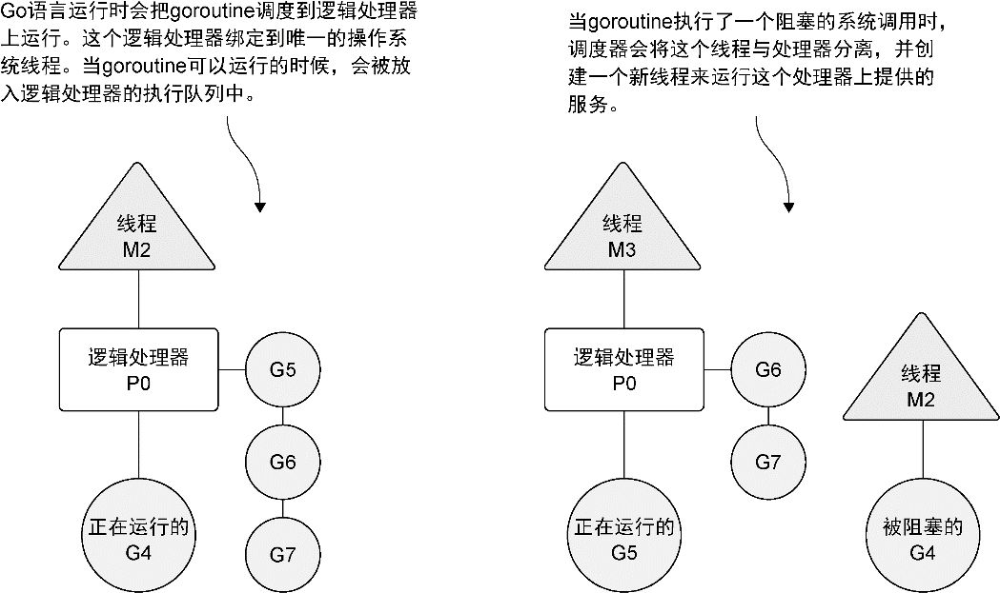

# Go 语言实战（Go in Action）

源代码：https://github.com/goinaction/code

## 类型的本质

在声明一个新类型之后，声明一个该类型的方法之前，需要先回答一个问题：这个类型的本质是什么。

如果给这个类型增加或者删除某个值，是要创建一个新值，还是要更改当前的值？如果是要创建一个新值，该类型的方法就使用值接收者。如果是要修改当前值，就使用指针接收者。

这个答案也会影响程序内部传递这个类型的值的方式：是按值做传递，还是按指针做传递。保持传递的一致性很重要。这个背后的原则是，不要只关注某个方法是如何处理这个值，而是要关注这个值的本质是什么。

### 内置类型

内置类型是由语言提供的一组类型，分别是数值类型、字符串类型和布尔类型。这些类型本质上是原始的类型。因此，当对这些值进行增加或者删除的时候，会创建一个新值。当把这些类型的值传递给方法或者函数时，应该传递一个对应值的副本。

### 引用类型

Go 语言里的引用类型有如下几个：切片、映射、通道、接口和函数类型。当声明上述类型的变量时，创建的变量被称作标头（header）值。从技术细节上说，字符串也是一种引用类型。

每个引用类型创建的标头值是包含一个指向底层数据结构的指针。每个引用类型还包含一组独特的字段，用于管理底层数据结构。

标头值里包含一个指针，因此通过复制来传递一个引用类型的值的副本，本质上就是在共享底层数据结构。

### 结构类型

```go
// File 表示一个打开的文件描述符
type File struct {
	*file
}

// file 是 *File 的实际表示
// 额外的一层结构保证没有哪个 os 的客户端能够覆盖这些数据
// 如果覆盖这些数据，可能在变量终结时关闭错误的文件描述符
type file struct {
	fd      int
	name    string
	dirinfo *dirInfo // 除了目录结构，此字段为 nil
	nepipe  int32    // Write 操作时遇到连续 EPIPE 的次数
}
```

是使用值接收者还是指针接收者，不应该由该方法是否修改了接收到的值来决定。这个决策应该基于该类型的本质。这条规则的一个例外是，需要让类型值符合某个接口的时候，即便类型的本质是非原始本质的，也可以选择使用值接收者声明方法。

## 接口

接口值是一个两个字长度的数据结构，第一个字包含一个指向内部表的指针。这个内部表叫作 iTable，包含了已存储的值的类型信息以及与这个值相关联的一组方法。第二个字是一个指向所存储值的指针。



一个指针赋值给接口之后发生的变化。类型信息会存储一个指向保存的类型的指针，而接口值第二个字依旧保存指向实体值的指针。



### 方法集

方法集定义了一组关联到给定类型的值或者指针的方法。

```
Values　　　　　　　　Methods Receivers
-----------------------------------------------
　　T　　　　　　　　　　(t T)
　 *T　　　　　　　　　　(t T) and (t *T)
```

接收者角度：
```
Methods Receivers　　 Values
-----------------------------------------------
　 (t T)　　　　　　　　　T and *T
　 (t *T)　　　　　　　　 *T
```

如果使用指针接收者来实现一个接口，那么只有指向那个类型的指针才能够实现对应的接口。

原因？

编译器并不是总能自动获得一个值的地址。

## 嵌入类型

嵌入类型（type embedding）是将已有的类型直接声明在新的结构类型里。被嵌入的类型被称为新的外部类型的内部类型。

通过嵌入类型，与内部类型相关的标识符会提升到外部类型上。这些被提升的标识符就像直接声明在外部类型里的标识符一样，也是外部类型的一部分。这样外部类型就组合了内部类型包含的所有属性，并且可以添加新的字段和方法。

外部类型也可以通过声明与内部类型标识符同名的标识符来覆盖内部标识符的字段或者方法。这就是扩展或者修改已有类型的方法。

由于内部类型的提升，内部类型实现的接口会自动提升到外部类型。如果外部类型实现了相同方法，内部类型的实现就不会提升。不过可以通过直接访问内部类型的值，来调用没有被提升的内部类型实现的方法。

### 公开或未公开的标识符

```go
// mian.go
package main

import (
	"demo/counters"
	"fmt"
)

func main() {
	n := counters.New(10)
	fmt.Println(n)
}
```

```go
// counters/counters.go
package counters

type alterCounter int

func New(value int) alterCounter {
	return alterCounter(value)
}
```

可以编译运行：
- 公开或者未公开的标识符，不是一个值
- 短变量声明操作符，有能力捕获引用的类型，并创建一个未公开的类型的变量

永远不能显示创建一个未公开类型的变量，不过短变量声明操作符可以这样做

## GMP





