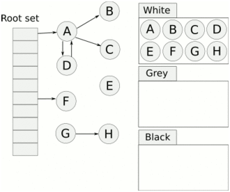

# Go 三色标记法

参考：
- [Golang 修养之路](https://www.kancloud.cn/aceld/golang/1958308)
- [Go GC](https://www.processon.com/view/60fbe47a637689719d24c16b)

## V1.3 标记清除（mark and sweep）

为什么选择标记清除？

从程序的根对象出发，对于可达的对象进行标记；对未能标记的对象进行删除。

### STW？

如果标记时不 STW，用户程序可能在标记执行的过程中修改对象的指针，可能会造成漏标、多标情况。

## V1.5 三色标记法

三色标记法将对象分为三类：
- 白色对象（可能死亡）：未被回收器访问到的对象。在回收开始阶段，所有对象均为白色，当回收结束后，白色对象均不可达。
- 灰色对象（波面）：已被回收器访问到的对象，但回收器需要对其中的一个或多个指针进行扫描，因为他们可能还指向白色对象。
- 黑色对象（确定存活）：已被回收器访问到的对象，其中所有字段都已被扫描，黑色对象中任何一个指针都不可能直接指向白色对象。

### 根对象

- 全局变量：程序在编译期就能确定的那些存在于程序整个生命周期的变量。
- 执行栈：每个 goroutine 都包含自己的执行栈，这些执行栈上包含栈上的变量及指向分配的堆内存区块的指针。
- 寄存器：寄存器的值可能表示一个指针，参与计算的这些指针可能指向某些赋值器分配的堆内存区块。

### 步骤

三色标记法（tricolor mark-and-sweep algorithm）是传统 Mark-Sweep 的一个改进，它是一个并发的 GC 算法，在 Go 中被用作垃圾回收的算法，但是也会有一个缺陷，可能程序中的垃圾产生的速度会大于垃圾收集的速度，这样会导致程序中的垃圾越来越多无法被收集掉。原理如下所示：

- step 1：创建：白、灰、黑 三个集合。
- step 2：将所有对象放入白色集合中。
- step 3：从根节点开始遍历所有对象，把遍历到的对象从白色集合放入灰色集合（这里放入灰色集合的都是根节点的对象）。
- step 4：遍历灰色集合，将灰色对象引用的对象（这里指的是灰色对象引用到的所有对象，包括灰色节点间接引用的那些对象）从白色集合放入灰色集合，然后将分析过的灰色对象放入黑色集合。
- step 5：直到灰色中无任何对象。
- step 6：通过写屏障（write-barrier）检测对象有变化，重复以上操作（因为 mark 和用户程序是并行的，所以在上一步执行的时候可能会有新的对象分配，写屏障是为了解决这个问题引入的）。
- step 7：收集所有白色对象（垃圾）。

### 三色不变性

想要在并发或者增量的标记算法中保证正确性，我们需要达成以下两种三色不变性（Tri-color invariant）中的任意一种：
- 强三色不变性 — 不存在黑色对象引用到白色对象的指针。
- 弱三色不变性 — 所有被黑色对象引用的白色对象都处于灰色保护状态（直接或间接从灰色对象可达）。

### 屏障技术

> [!note|label: 内存屏障]
>
> 内存屏障技术是一种屏障指令，它可以让 CPU 或者编译器在执行内存相关操作时遵循特定的约束，该技术能够保证内存操作的顺序性，在内存屏障前执行的操作一定会先于内存屏障后执行的操作。

实现方式：垃圾收集中的屏障技术更像是一个钩子方法，它是在用户程序读取对象、创建新对象以及更新对象指针时执行的一段代码。

分类：根据操作类型的不同，我们可以将它们分成读屏障（Read barrier）和写屏障（Write barrier）两种。

注：读屏障需要在读操作中加入代码片段，对用户程序的性能影响很大，所以编程语言往往都会采用写屏障保证三色不变性。

> [!note|label: 插入写屏障]
>
> 满足强三色不变性
>
> 在黑色引用白色对象时候，将白色对象置为灰色（增量更新）

为什么每次 GC 要重新扫描栈？
- v1.8 版本之前，运行时会使用 ` 插入写屏障 ` 保证强三色不变性，但处于性能开销，GC 时并没有在所有的垃圾收集根对象上开启插入写屏障。
- 由于栈特点是容量小，速度快，所以插入屏障在栈空间中不使用。为了保证三色不变性，Go 在实现上选择了 ` 在标记阶段完成时 暂停程序 `，重新扫描栈。

> [!note|label: 删除写屏障]
>
> 满足弱三色不变性
>
> 在灰色对象删除对白色对象的引用时，将白色对象置为灰（快照保存旧的引用关系 STAB snapshot-at-the-beginning）
>
> 回收精度低，延迟一轮回收

## V1.8 混合写屏障机制

1. GC 开始将 ` 栈 ` 上的对象全部扫描并标记为黑色（之后不再进行第二次重复扫描，无需 STW）
2. GC 期间任何在 ` 栈 ` 上创建的新对象，均为黑色
3. 被删除的对象标记为灰色
4. 被添加的对象标记为灰色

## GC 触发时机

1. 分配内存时，达到 GOGC 比例
	- 分配内存时，当前已分配内存与上一次 GC 结束时存活对象的内存达到某个比例时就触发 GC。
	- 默认配置会在堆内存达到上一次垃圾收集的 2 倍时，触发新一轮的垃圾收集，可以通过环境变量 GOGC 调整，在默认情况下它的值为 100，即增长 100% 的堆内存才会触发 GC。
2. 后台触发
	- sysmon 检测出一段时间内（由 runtime.forcegcperiod 变量控制，默认为 2 分钟）没有触发过 GC，就会触发新的 GC。
3. 手动触发
	- 调用 runtime.GC() 强制触发 GC。