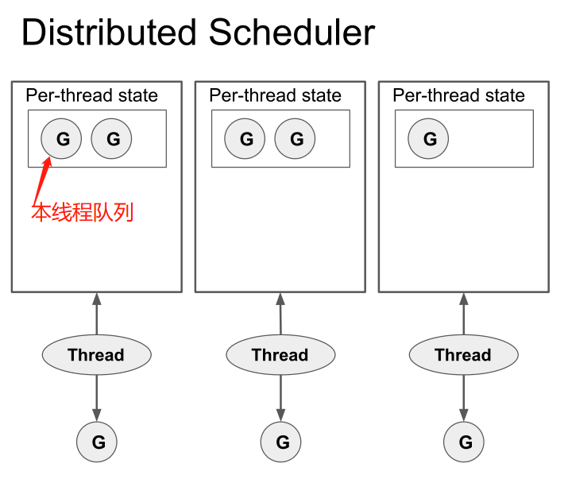

# 从 Go 调度器的作者视角探究其设计之道

转自：https://cloud.tencent.com/developer/article/1958311

## 前言

Golang 核心开发人员、goroutine 调度的设计者 Dmitry Vyukov，在 2019 年的一个 talk 里深入浅出地阐述了 goroutine 调度的设计思想以及一些优化的细节。本文是笔者结合自身经验和认知的一点观后感，采用从零开始层层递进的方法，总结剖析了其背后的软件设计思想，希望对读者更好地理解 goroutine 调度 GMP 模型会有所帮助。

视频地址：https://2019.hydraconf.com/2019/talks/7336ginp0kke7n4yxxjvld/

这个视频我以前看过，近几天刷到便又看了一遍，真是有听君一席话受益匪浅之感。毫不夸张地说，本视频在笔者看过的所有资料中，对于 GMP 为什么要有 Processor 这点，讲得最为清楚。视频中对 goroutine 调度模型的讲解，真可谓深入浅出！下面笔者将自己的一些观感整理分享给大家，还没看过视频的同学，建议先看完本文再去看，收获会更大。

## 一、设计并发编程模型

goroutine 调度的设计目标，其实就是设计一种高效的并发编程模型：

- 从开发的角度只需要一个关键词（go）就能创建一个执行会话，很方便使用，即开发效率是高效的。
- 从运行态的角度，上述创建的会话也能高效的被调度执行，即运行效率也是高效的。

我们可以近似将 goroutine 看待为协程（一些代码逻辑 + 一个栈上下文），如果读者用 C/C++ 造过协程框架的轮子，会很容易理解这点。

注：除了高效之外，还有其他几个目标，如无大小限制的 goroutine 栈，公平的调度策略等。

## 二、从零开始：从多线程说起

想要实现并发的执行流，最直截了当的，自然就是多线程。由此便得出初始思路：每个 goroutine 对应一个线程。

从并发的功能角度来讲，该方案固然可以实现并发，但性能方面却很不堪，尤其是在并发很重的时候，成千上万个线程的资源占用、创建销毁、调度带来的开销会很巨大。

## 三、更进一步：线程池的方案

既然线程太多不好，那我们可以很轻易地做出一点改善，控制一下线程数量，如此便得到更进一步的方案：线程池，限定只启动 N 个线程。

由于该方案下，可能是 M 个 goroutine，N 个线程，因而显然需要考虑一个问题：对于一个 goroutine，它到底该由哪个线程去执行？我们可以简单地采用一个全局的 Global Run Queue，然后让所有线程主动去获取 goroutine 来执行，示意如下：

这样做在线程少的时候，如果调度行为不是很频繁，可能问题不大。但当线程较多时，就会有 scalable 的问题，mutex 的互斥竞争会非常激烈（考虑到基于时间片的抢占行为，实际上调度必然是很频繁的）。

## 四、初具雏形：线程分治

在多线程编程领域中，互斥处理可以称得上是「名声在外」，需极其小心地去应对。最常见的解决方案，并不是如何精妙地去 lock free，而是直接通过「数据分治」和「逻辑分治」来避免做复杂的加锁互斥，将各个线程按横向（载荷分组）或纵向（逻辑划分）进行切分来处理工作。

通过数据分治的思想，我们就可以得到改进的方案：每个线程分别处理一批 G，进行线程分治。将所有 G 分开放到各线程自己的存储中，即所谓的 Local Run Queue 中。示意如下：

注：Global Run Queue 也还继续存在的，有关它存在的细节非本文重点，这里不做展开。

至此，调度模型已具雏形。

让我们继续分析确认一下，该模型是否真的解决了 scalable 的问题。上述模型下，为了充分利用 CPU，每个线程要按一定的策略去 Steal 其他线程 Local Run Queue 里面的 G 来执行，以免线程之间存在 load balance 问题（有些太闲，有些又太忙）。

因此在线程很多的时候，存在大量的无意义加锁 Steal 操作，因为其他线程的 Local Run Queue 可能也常常都是空的。还有另一个问题，由于现在的一些内存资源是绑定在线程上面的，会导致线程数量和资源占用规模紧耦合。当线程数量多的时候，资源消耗也会比较大。

注：在 N 核的机器环境下，假如我们设定线程池大小为 N，由于系统调用的存在（关于系统调用的处理见后文），实际的线程数量会超过 N。

## 五、趋于完善：将资源和线程解耦

既然每个线程一份资源也不合适，那么我们可以仿照线程池的思路，单独做一个资源池，做计算存储分离：把 Local Run Queue 及相关存储资源都挪出去，并依然限定全局一共 N 份，即可实现资源规模与系统中的真实线程数量的解耦。线程每次从对应的数据结构（Processor）中获取 goroutine 去执行，Local Run Queue 及其他一些相关存储资源都挂在 Processor 下。这样加一层 Processor 的抽象之后，便得到众所周知的 GMP 模型：

现在的调度模型已趋于完善，不过前面我们主要侧重讲的是如何高效，还未讨论到调度的另一个关键问题：`公平性与抢占`，接下来我们看看如何实现抢占。

## 六、还要公平：调度抢占

参考操作系统 CPU 的调度策略，通常各进程会分时间片，时间片用完了就轮到其他进程。在 golang 里也可以如此，不能让一些 goroutine 长期霸占着运行资源不退出，必须实现基于时间片的抢占。

那怎么抢占呢，需要监测 goroutine 执行时间片是否用完了。如果要检查系统中的各种状态变化、事件发生情况，通常会有中断与轮询两种思路，中断是由一个中控方来做检查与控制，而轮询则是各个参与方按一定的策略主动 check 询问。因此对于 goroutine 抢占而言，有以下两种解决方案：

- Signals，通过信号来中断原来的线程执行。
- Cooperative checks，通过线程间歇性轮询自己 check 运行的时间片情况来主动暂停。

二者的优劣对比如下：

因为 golang 其实是有 runtime 的，而且代码编译生成也都是 golang 编译器控制的，综合优劣分析，选择后者会比较合理。

对于 Cooperative checks 的方案，从代码编译生成的角度看，很容易做 check 指令的埋点。且因为 golang 本来就要做动态增长栈，在函数入口处会插入检查是否该扩栈的指令，正好利用这一点来做相关的检查实现（这里有一些优化细节，可以使得基于时间片的抢占开销也较小）

插入 check 指令的做法，会导致该方案存在一个理论缺陷：若有一个死循环，里面的所有代码都不包含 check 指令，那依然会无法抢占，不过现实中基本不存在这种情况，总会做函数调用、访问 channel 等类似操作，因此不足为虑。

除此以外还有一个系统调用的问题，当线程一旦进入系统调用后，也会脱离 runtime 的控制。试想万一系统调用阻塞了呢，基于 Cooperative checks 的方案，此时又无法进行抢占，是不是整个线程也就罢工了。所以为了维持整个调度体系的高效运转，必然要在进入系统调用之前要做点什么以防患未然。Dmitry 这里采用的办法也很直接，对于即将进入系统调用的线程，不做抢占，而是由它主动让出执行权。线程 A 在系统调用之前 handoff 让出 Processor 的执行权，唤醒一个 idle 线程 B 来做交接。当线程 A 从系统调用返回时，不会继续执行，而是将 G 放到 run queue，然后进入 idle 状态等待唤醒，这样一来便能确保活跃线程数依然与 Processor 数量相同。

## 七、设计思想的小结

这里 recap 一下，把前文涉及到的一些软件设计思想罗列如下：

- `线程池`，通过多线程提供更大的并发处理能力，同时又避免线程过多带来的过大开销。
- `资源池`，对有一定规模约束的资源进行池化管理，如内存池、机器池、协程池等，前面的线程池也可以算作此类。
- `计算存储分离`，分别从逻辑、数据结构两个角度进行设计，规划二者的耦合关系。
- 加一层，这个是万能大法，不赘述。
- `中断与轮询`，用于监测系统中的各种状态变化、事件变化，通常来讲中断会比轮询更高效。

## 八、视频的其他内容

本文的重点在 GMP 模型，因此视频里还有一些其他的内容，文中并未详细展开：

- Local Run Queue 里面的 G 所创建的 G 会放到同样的 Local Run Queue（如果满了还是会放 GRQ），而且会限制被偷走，这样可以加强 Locality，同时为了保证公平也做了时间片继承，以免不停创建 G 会长期霸占运行资源。
- 被抢占的 G 会放到全局的 G 队列（Global Run Queue），GRQ 会每 61 次 tick 检查一次，Dmitry 针对这个 61 解释了一番，但笔者认为还是有点拍脑袋的感觉。
- G 的栈采用的是 Growable stack 方案，在函数入口会有栈检查的指令，如需扩容栈，会拷贝到新申请的更大的栈。
- Go runtime 还会用 Background thread 来运行一些相对特别的 G（如 Network Poller、Timer）。

以上这些内容，大家可以去视频学习。

注：本文基于 2019 的 talk，不知最新版本的调度机制是否有进一步的调整，不过无论调整与否，这并不妨碍我们对 GMP 设计思想的学习。

## 九、进一步的改进

有同学在与笔者讨论时提了一个问题：`还可以怎么继续优化`，这真的是一个非常好的问题，这里将该问题的回答也放入文章。

不单纯针对 GMP，话题稍微放大一点，下面简单聊聊 goroutine 调度机制的一些优化可能。

Dmitry 自己在视频最后说的 future work 方向：

- 在很多 cpu core 的情况下，活跃线程数比较多，work steal 的开销依旧有些浪费。
- 死循环不含 cooperative check 指令的这种 edge 情况的还没解决。
- 对于网络和 timer 的 goroutine 处理是使用全局方式的，不好 scale。

以下纯属个人探讨：

- 首先整体上现在的模型已经比较完善，如何进一步优化要看实践场景遇到的问题，以及 profile 数据情况，只有问题和数据明确了，才清楚进一步工作的宏观重点（工作中也是，做性能优化需要有宏观视角）。
- 因为 goroutine 调度是属于协程类的调度，这里或许可以借鉴原来各种协程框架的思路做一些对比考虑。
- 由于笔者并没细看过代码，不大清楚 work steal 的 overhead 构成，或许可以设计其他的 rebalance 方式，例如换个视角，不是去 steal，而是由 runtime 统一 rebalance 再收集派发。
