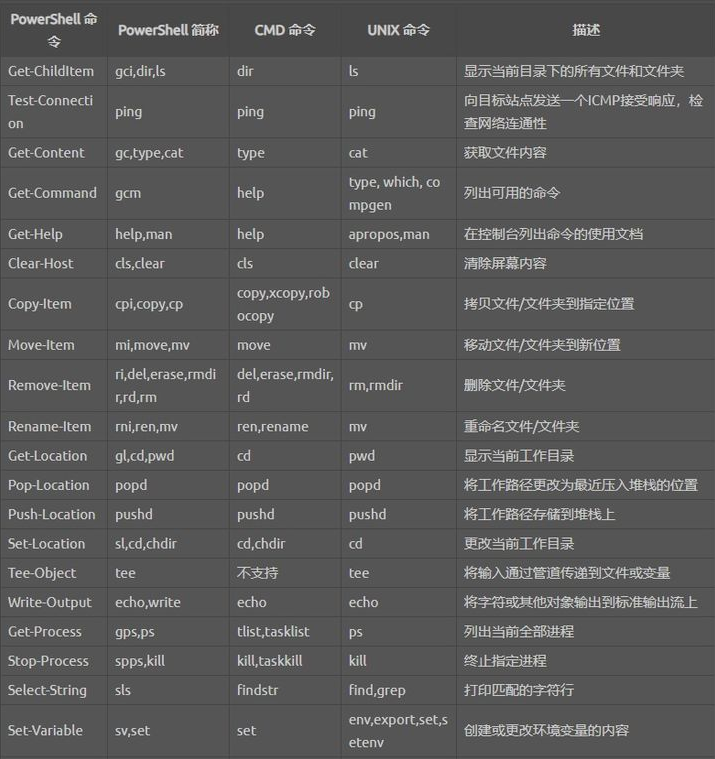

# PowerShell 常用命令

[官方教程](https://docs.microsoft.com/zh-cn/learn/paths/powershell/)

[PowerShell 入门指南 (三)· 一门新的编程语言](https://zhuanlan.zhihu.com/p/76708298)

> [!note]
> PowerShell 被编译成 AST，检查是否存在问题，然后重新翻译，以便计算机能够理解。

## 基础

- PowerShell 的解释器不会考虑代码中的空格或制表符
- 文本块：`@''@` 或 `@" "@`
- 变量：$ 开头，剩余可以为数字、字母、下划线
- 变量名可以用花括号 {} 括起来
- 将变量限制为静态类型：在变量前添加类型限定符，如 `[int]$num=123`
- 单引号：不识别变量；双引号：识别变量
- 列出当前使用的所有变量：`ls variable:`
- 查看变量的数据类型：$变量名.GetType()
- 删除变量：`del variable:变量名`
- 浮点型转整型转换时，进行四舍五入。向下取整参考 convert 类
- `$()` 在双引号内编写表达式


### 快捷键和功能键

内置 PSReadLine，支持的功能键和快捷键部分如下：

| Parameter	| Description |
| :---: | :---: |
| 从光标处向下创建新行 | <Shift+Enter> |
| 下一行创建新行，光标移动到开头 | <Shift+Ctrl+Enter> |
| 上一行创建新行 | <Ctrl+Enter> |
| 删除一个单词 | <Ctrl+Backspace> |
| 清除 PSReadLine 的历史记录 | <Alt+F7> |
| 清空当前命令行 | `<Esc>` |


### 运算符

```powershell
+ - * / % #加 减 乘 除 取余
-and # 且
-or # 并
-not # 非
! # 非
-eq # 等于 (equal to)
-ne # 不等于 (not equal to)
-gt # 大于 (greater than)
-ge # 大于等于 (greater than or equal to)
-lt # 小于 (less than)
-le # 小于等于 (less than or equal to)
```

对于字符串类型，可以在比较运算符前加 i 或 c 表示是否区分大小写，i 表示对大小写不敏感，c 表示敏感，不写默认不敏感。

#判断变量是否为兼容类型 (同一类型或其父类型)：`-is [类型名 ]`
```powershell
-is
# 示例
$a = 0
$a -is [int]
$b=1, 2, 3
$b -is [array]
```

### 条件分支

1. if-elseif-else：大括号不允许省略

2. switch

```powershell
# 相对 C# 或 C++，PowerShell 的 switch 不需要写 case，但是必须写大括号
$a = "Beijing"
switch ($a) {
    "Beijing" { $res = "北京" }
    "Shanghai" { $res = "上海" }
}

# 默认比较运算符为 -eq，也可以自定义比较条件，必须保证表达式返回 bool 类型（$true 和 $false）
$v = 18
switch ($v) {
    { $_ -lt 10 } { "小于 10" }
    10 { "等于 10" }
    { $_ -gt 10 } { "大于 10" }
}
```

3. foreach

```powershell
$a = "A", "B", "C", "D", "E"
foreach ($n in $a) {
    $n + " " + $n
}
```

### 创建数组

> [!note]
> 创建数组：`@(<元素>, < 元素 >, ...)`
>
> 哈希表：`@{<键> = < 值 >; ...}`

```powershell
$nums = 1..5
$nums = 2, 0, 1,2

# 空数组
$a = @()

# 显示数组长度
$a.Count

# 数组中添加元素
$books += "D4"

# 删除元素
$num = $num[0..1] + $num[3] # 相当于删掉了第三项

# 复制数组（ = 只复制引用，深拷贝使用 Clone() 方法）
$chsNew = $chs.Clone()

# 强类型数组
[int[]] $nums = @()

# PowerShell 会把文本按每一行作为元素存为数组
# 如果一个命令的返回值不止一个结果时，PowerShell 也会自动把结果存储为数组

# 转换为字符数组
$str.ToCharArray() -is [array]

```

### 命令对比

PowerShell 命令为动词 + 名词结构的 Cmdlet




## 对象与 .NET

PowerShell 中使用 .NET：
- 完全访问 .NET 框架类
    - New-Object 创建对象
    - `New-Object <类型名> <构造函数-参数>`
- 访问类通过 [<类型名>]
    - 例如：`[System.Version]`
- 类型转换
    - 例如：`[System.Version] "1.0.3.4"`
- 访问类的静态元素
    - 类方法、枚举 ...
    - 例如：`[System.Version]::New()`、`[System.ConsoleColor]::Red`


```powershell
# PowerShell v5.0 -> 自定义类
# 新关键字：Class Enum Static
# New-Object

enum VersionType {
    SoftwareVersion = 1
    HardwareVersion = 2
}
[VersionType]::SoftwareVersion
```


## 常用命令

> [!note]
> Where-Object：筛选对象
>
> Select-Object：选择对象
>
> -replace：搜索或替换字符串中的文本
>
> -join：连接字符串 `-join ('a', 'b', 'c')` `'127', '0', '0', '1' -join '.'`


### 查找命令

> [!tip]
> Cmdlet 根据动词 - 名词命名标准命名。

```powershell
# 查看动词列表，动词按活动类型和功能进行组织。
Get-Verb

# Get-Command cmdlet 列出系统上的所有可用 cmdlet。
Get-Command

# -Noun：指定名词部分
# -Verb：指定动词部分
# 例如：
Get-Command -Verb Get -Noun a-noun*

Get-Help

Get-Member
# 响应的第一行为返回对象的类型。知道类型后，可搜索对同一类型运行的其他 cmdlet。

Get-Process | Get-Member

#    TypeName: System.Diagnostics.Process

# 使用此类型作为搜索参数，查找使用此类型的其他 cmdlet。

Get-Command -ParameterType Process | Format-Table -AutoSize

# CommandType Name                  Version Source
# ----------- ----                  ------- ------
# Cmdlet      Debug-Process         7.0.0.0 Microsoft.PowerShell.Management
# Cmdlet      Enter-PSHostProcess   7.1.4.0 Microsoft.PowerShell.Core
# Cmdlet      Get-Process           7.0.0.0 Microsoft.PowerShell.Management
# Cmdlet      Get-PSHostProcessInfo 7.1.4.0 Microsoft.PowerShell.Core
# Cmdlet      Stop-Process          7.0.0.0 Microsoft.PowerShell.Management
# Cmdlet      Wait-Process          7.0.0.0 Microsoft.PowerShell.Management

# 获取完整的响应
Get-Process pwsh | Format-List -Property *

# 选择特定的列
Get-Process pwsh | Select-Object -Property Id, Name, CPU

# 排序
# 按 Name 列进行降序排序的。
Get-Process | Sort-Object -Descending -Property Name
# 多个列进行排序，用逗号来分隔列名
Get-Process | Sort-Object -Descending -Property Name, CPU
# 自定义排序
Get-Process 'some process' | Sort-Object -Property @{Expression = "Name"; Descending = $True}, @{Expression = "CPU"; Descending = $False}


Get-Process | Where-Object CPU -gt 100 | Sort-Object CPU -Descending | Select-Object -First 3

```
> [!tip]
> PowerShell 只需一次了解一点就可以了。
> 发现相关 cmdlet 的一个好方法是使用返回的类型按类型搜索 cmdlet。

### 管道

> [!tip]
> 尽早筛选所需的结果，尽晚的格式化数据（格式设置会破坏你正在处理的对象）。
> `Get-Process -Name name-of-process | Select-Object Name`

```powershell
Get-Process 'some process' | Select-Object Name, CPU
Get-Process 'some process' | Format-Table Name, CPU | Select-Object Name, CPU
# Name CPU
# ---- ---
它是空值，因为 Format-Table 转换了对象，将所述的数据置于其他属性中。
数据不会消失，只有属性会，上述 PowerShell 会尝试解析不存在的属性。
```

### 查看当前 PowerShell 版本

```powershell
$PSVersionTable

Get-Host

$Host.Version
```

### 修改 powershell 执行策略

[官方文档](https://docs.microsoft.com/zh-cn/powershell/module/microsoft.powershell.core/about/about_execution_policies?view=powershell-7.1)

> [!tip]
> Set-ExecutionPolicy 默认设定 LocalMachine

```powershell
Set-ExecutionPolicy -Scope LocalMachine -ExecutionPolicy Bypass
```

powershell 执行策略：

- Restricted：（Windows 客户端的默认执行策略）允许运行单独的命令，但不允许运行脚本。
- AllSigned：允许运行具有数字签名的脚本。
- RemoteSigned：（Windows 服务器的默认执行策略）从网络上下载的脚本运行需要具有数字签名；在本地创建的脚本可以直接运行。
- Unrestricted：（非 Windows 计算机的默认执行策略，并且无法修改）未签名的脚本可以运行。
- Bypass：不阻止任何操作。
- Undefined：当前作用域中没有设置执行策略。

获取执行策略：
```powershell
Get-ExecutionPolicy -List

# 输出
#         Scope ExecutionPolicy
#         ----- ---------------
# MachinePolicy       Undefined
#    UserPolicy       Undefined
#       Process       Undefined
#   CurrentUser          Bypass
#  LocalMachine          Bypass

# 作用域优先级：从上到下
# MachinePolicy 和 UserPolicy 需使用组策略进行设置
# Process 作用域有限期范围保留到当前进程和任何子进程关闭为止
```

组策略对象
本地计算机策略 -> 系统配置 -> 管理模版 ->  Windows 组件 -> Windows Powershell 中找到 Powershell 的设置选项

### Invoke-WebRequest

别名：iwr

UNIX 命令：wget curl

curl 和 wget 不在 PowerShell Core 中，因此不会干扰调用非 Windows 操作系统的同名组件。

### Format-List *

查看对象的属性和方法

### 输入输出函数

```powershell
# 输入（提示信息后面自动加变量）
$name = Read-Host "请输入你的名字"
# 输出（不放置任何数据到管道中，试用与人机交互情况。可指定前景色和背景色）
Write-Host "啊哈" -ForegroundColor White -BackgroundColor Red
# 将对象发送到管道，不会直接发送到显示界面
Write-Output
```

在输出多个对象时，Write-Host 会以空格隔开各对象，Write-Output 会以换行隔开各对象。

Write-Output 输出基本过程为：

1. Write-Output 命令将 string 类型的对象 Hello World! 放入管道中
2. 管道中只有这个 string 对象，其会直接到达管道的末端，也就是 Out-Default 命令
3. Out-Default 命令将对象传递给 Out-Host 命令
4. Out-Host 命令要求 PowerShell 的格式化系统格式化该对象
5. Out-Host 将格式化的结果集放在显示界面上

[其他的输出方式](https://docs.microsoft.com/zh-cn/powershell/module/microsoft.powershell.utility/write-debug?view=powershell-7.1)

Powershell 会将函数中所有的输出作为返回值，但是也可以通过 return 语句指定具体的返回值。

如果要过滤注释，只输出，不作为返回值，可以使用 Write-Host 命令。

