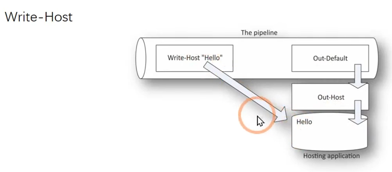
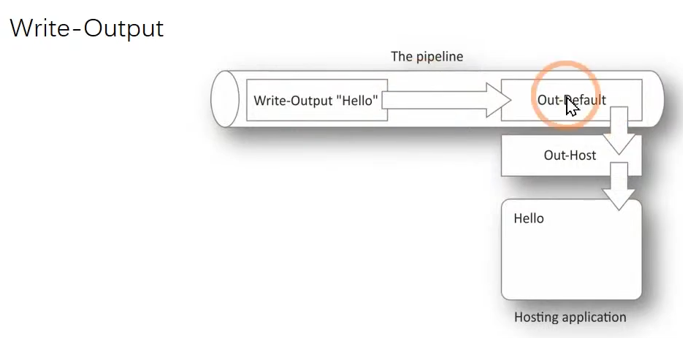

# 一条命令学习 PowerShell

## 帮助系统

### 构成部分

本地帮助文档：
1. 命令名称 (NAME)
2. 语法 (SYNTAX)
3. 参数 (PARAMETERS)
4. 输入 (INPUTS)
5. 输出 (OUTPUTS)
6. 别名 (ALIASES)
7. 备注 (REMARKS)

更新本地帮助系统：
```powershell
# 管理员权限启动
update-help
# 默认 Update-Help 命令每日只能获取一次。可使用 -Force 标志重写此获取行为。
# 本地帮助文档更新失败
Update-Help -UICulture en-US -ErrorAction SilentlyContinue
```

知识点：
- 一个或多个命令集，互斥关系
- 可选参数 `[]` 和必选参数 `<>`
- 位置参数：positon 代表位置编号

### 详细信息

模糊查询：`help　*update*`

详细帮助文档：使用参数 -full、-showWindow

开关参数：不需要赋值的参数

样例：`-Examples`

在线帮助：`-online`

关于 `help *about*`


## Providers

查看当前 PS 的种类：
```powershell
Get-PSProvider

# Name                 Capabilities                    Drives
# ----                 ------------                    ------
# Registry             ShouldProcess                   {HKLM, HKCU}
# Alias                ShouldProcess                   {Alias}
# Environment          ShouldProcess                   {Env}
# FileSystem           Filter, ShouldProcess, Credent… {C, Temp, E}
# Function             ShouldProcess                   {Function}
# Variable             ShouldProcess                   {Variable}
```

- shouldProcess：可支持 `-whatIf`、`-Confirm` 参数
- Filter：支持 `-Filter` 参数
- Credentials：支持凭据参数（-Credentials）连接数据存储
- Transactions：支持事务，提交操作、回滚等

```powershell
# 查看当前已连接的驱动器
Get-PSDrive

# 切换位置
Set-Location temp:
```

查找与 Item 相关的命令：
- Get-Childltem
- Get-ltemProperty
- Get-Location（别名：cd）
- Set-ltemProperty

```powershell
Get-Command -Noun *item*

# CommandType     Name                              Version    Source
# -----------     ----                              -------    ------
# Function        Get-ChildItemColor                2.2.0      Get-C…
# Function        Get-ChildItemColorFormatWide      2.2.0      Get-C…
# Function        Get-DAEntryPointTableItem         1.0.0.0    Direc…
# Function        Get-TestDriveItem                 3.4.0      Pester
# Function        New-DAEntryPointTableItem         1.0.0.0    Direc…
```

```powershell
Get-PSDrive
Set-Location -path
Get-ItemProperty -path . -name *
Set-ItemProperty -path . -name XX. -value X
Get-Childltem -recurse -filter *XXX*
```


## 管道

```powershell
Get-Service XblGameSave | Start-Service -pass
```

```powershell
# 查看当前 A 命令输出的类型
# 查看当前 A 命令的属性、方法等
Get-Member
```

管道参数输入类型：
1. ByValue：只允许使用一个参数接收管道返回的对象类型，一个参数接收了 String，那么其它参数就不能再接收该参数。
2. ByPropertyName：不同于 ByValue (一次只能有一个属性参数接收管道返回的类型)，它可实现一次传入多个参数类型，并且命令自动完成匹配。


注意：
```powershell
# 命令执行成功，但无意义，因为不同类。
Get-content 计算机名的文件.txt | start- service
```

> [!TIP]
> AB 命令同类，一般均能成功传递参数，比如: *-service(get-service、stop-service、start-service)


## 对象

命令执行后，输出内容的每一行，就是一个对象。

重要概念：

| 概念 | 含义 |
| :--: | :-- |
| 属性 | 对象的部分信息，输出中的 "表" 列。比如状态 (Status) 、名称(Name) 等。
| 集合 | 所有对象在一起，被称作 "集合"。即整体的这张 "表"。
| 方法 | 某个对象能执行的 "动作"。比如: 开启、暂停、停止某项服务。


### 查看对象有哪些属性、方法等内容

```powershell
command | Get-Member

# 显示指定的属性
Get-Service | select -Property ServiceName, Status, DisplayName
```

### 使用（对象）方法

```powershell
# 停止指定服务

# 方法一、通过管道，连接 stop-service 命令，停止该服务。
Get-Service -DisplayName *spoo* | Stop-Service

# 方法二、使用对象方法，停止该服务。
$print = Get- Service -DisplayName *spoo*
$print.stop()

# 方法三、直接使用对象方法，停止服务。
(Get-Service -name spooler).Stop()
```

## 比较操作符

特点：
- 不区分大小写；需要区分大小写 -CXX，比如 -ceq
- 单个值之间或单个值与多个值比较，输出 boolean 值（TRUE 或者 FALSE）
- 多个和单个值比较，输出满足条件的值


## 脚本块

```powershell
# .NET框架命令下使用
Invoke-Command -ScriptBlock { Get-Service }

# 变量使用法
$var = { get-service }
&$var

# 与比较符联合使用
# 1. Where-Object (-FilterScript)
Get-Process | Where-Object -FilterScript { $_ -like "*VM*" } 
# 2. ForEach-Object (-Process)
Get-Process | ForEach-Object -Process { if ($_ -like "*VM*") { $_.name } }
# 3. Select-Object (自定义属性名称)
Get-Process | Select-Object -Property ProcessName, { $_.StartTime.DayOfWeek }
```


## 模块

> [!tip]
> [官方文档](https://docs.microsoft.com/en-us/powershell/module/microsoft.powershell.core/about/about_modules?view=powershell-7.1)

```powershell
# 查找需要的模块
help *dns*
Find-Module *DNS*


# 查看当前可用的模块
Get-Module -ListAvailable

# 查看模块路径
Get-Content Env:\PSModulePath

# 查看对应文件夹下的内容（dIl 文件、帮助文档（*-help.xml））

# 查看模块具有哪些命令
Get-Command -Name ModuleName


# 加载模块

# 加载 (引用) 模块
Import-Module -Name ModuleName

# 查看是否引入成功
Get-Module


# 移除模块
Remove-Module -Name ModuleName


# 安装模块
Install-Module ModuleName -RequiredVersion X.X.X

# 升级模块
Update-Module ModuleName

# 删除模块
Uninstall-Module ModuleName
# 删除多个模块使用逗号分隔
```

> [!tip]
> 在 powershell3.0 后，可跳过加载模块步骤直接使用命令，系统自动引入对应模块。（help Get-Module）。


## ForEach-Object

```powershell
# 一
Get-ChildItem -Path "C:\Users\myp\AppData\Local\Packages\Microsoft.Windows.ContentDeliveryManager_cw5n1h2txyewy\LocalState\Assets"
| ForEach-Object -Begin {
    $daytime = Get-Date -Format FileDateTime | ForEach-Object {
        $_ -replace "T", "_"
    }
    $char = "_"
    $i = 1
    $today = Get-Date
    $yesterday = $today.AddDays(-1).ToString("yyyy.MM.dd")
} -Process {
    if ($_.LastWriteTime -gt $yesterday) {
        Copy-Item  $_.FullName "C:\Users\myp\Desktop\$daytime$char$i.jpg"
        $i++
    }
} -End {
    Get-Date; "Complete!"
}


# 二
Get-ChildItem -Path "C:\Users\myp\AppData\Local\Packages\Microsoft.Windows.ContentDeliveryManager_cw5n1h2txyewy\LocalState\Assets"
| Where-Object {
    $_.LastWriteTime -gt "2021.07.26"
}
| ForEach-Object -Begin {
    $daytime = Get-Date -Format FileDateTime | ForEach-Object {
        $_ -replace "T", "_"
    }
    $char = "_"
    $i = 1
} -Process {
    Copy-Item  $_.FullName "C:\Users\myp\Desktop\$daytime$char$i.jpg"
    $i++
} -End {
    Get-Date; "Complete!"
}
```


## 输出

```powershell
# 输出返回结果到屏幕的方法
Write-Host

Write-Host Get-Date -ForegroundColor yellow -BackgroundColor magenta


# 输出返回结果，可以传递给管道的方法
Write-Output Get-Date
```






## 格式化输出

```powershell
# 输出返回结果到屏幕的方法
Out-Default

# 默认加在每个管道最后
# 字符串类型，直接输出
# 其它对象类型，根据情况而定
```

默认格式化输出流程

1. ".format.ps1xml" 文件
    - 根据管道输入内容，查找 "Powershell home" 目录下的 ".format.ps1xml" 文件，是否定义了该类型的输出格式
2. "Types.ps1xml" 文件
3. 确定输出格式
    - 输出项为 4 个及以下，采用表格输出
    - 输出项为 5 个及以上，采用列表输出


### 格式化表格和表列

```powershell
# 格式化表格
Cmdlet | Format-Table -XXX
# 例如 Get-ChildItem | Format-Table -AutoSize

# 保证列有足够的空间，表格更紧凑
-AutoSize

# 选择显示的属性，以逗号（,）分隔，支持通配符
-Property
# Get-ChildItem | Format-Table -Property name

# 按指定属性进行排序
-GroupBy

# 不截断列信息
- wrap
```

```powershell
# 格式化列表
Cmdlet | Format-List -XXX
# 例如 Get-ChildItem | Format-List

# 选择显示的属性，以逗号（,）分隔，支持通配符
-Property
# Get-ChildItem | Format-List -Property Name, Length, LastAccessTime

# 按指定属性进行排序
-GroupBy
```


### 自定义列

自定义列：
- 哈希表
    - 格式：`@{name = 'XXX'; expression = {XXX}`
    - 要点
        1. 以 @ 开头
        2. 采用花括号包含内容 {}
        3. 两个键值对，name 和 expression。name 可以用 N、L、l（小写 L）代替，expression 可以用 E、e 代替
        4. 中间使用分号（;）隔开


```powershell
# 查看某文件夹下的文件，显示名称、文件大小等属性，其中自定义文件大小属性，以 MB 为单位显示。
# 哈希表格式：
@{name = "FileSize(MB)"; expression = { $_.Length / 1MB } }

Get-ChildItem | Format-Table -Property Name, @{
    Name = "FileSize(KB)"; expression = {
        $_.Length / 1KB -as [int]
    }
} -AutoSize
```


## PowerShell 脚本

1. 脚本参数
    - 在脚本前面添加 param()
    - 设定变量，即参数 (默认值)

2. 脚本帮助文档
    - 在脚本前面添加 `<##>`
    - 帮助文档内容
        - .SYNOPSIS
        - .DESCRIPTION
        - .EXAMPLE
        - ...
    调用方法
    - `Help ./xxx.ps1 [-full、-example、...]`


```powershell
<#
.SYNOPSIS
    copy and rename these pictures
.DESCRIPTION
    copy and rename these pictures, and ...
.EXAMPLE
    .\Copy_Rename_date-note.ps1 -DiyDate 2020.01.01
.EXAMPLE
    .\Copy_Rename_date-note.ps1 -DiyDate "2020.01.01"
.EXAMPLE
    .\Copy_Rename_date-note.ps1 2020.01.01
#>

param (
    $DiyDate = "2021.08.26"
)

Get-ChildItem -Path "C:\Users\myp\AppData\Local\Packages\Microsoft.Windows.ContentDeliveryManager_cw5n1h2txyewy\LocalState\Assets"
| ForEach-Object -Begin {
    $daytime = Get-Date -Format FileDateTime | ForEach-Object {
        $_ -replace "T", "_"
    }
    $char = "_"
    $i = 1
} -Process {
    if ($_.LastWriteTime -gt $DiyDate) {
        Copy-Item  $_.FullName "C:\Users\myp\Desktop\$daytime$char$i.jpg"
        $i++
    }
} -End {
    Get-Date; "Complete!"
}
```


## 远程命令执行

```powershell
# 1. 1 连接
Enter-PSsession -ComputerName localhost -Credential administrator\--

# 2. N 连接
Invoke-Command -ComputerName localhost, hostB, HostC -Command {Get Process} -Credential administrators\--
```

## 正则表达式

`-match`
- "示例串" -match "正则表达式"
- 返加 "True" 或 "False"

正则表达式文本匹配
- `| Select-String -Pattern xxx`
- 管道符之后给出正则表达式


```powershell
Get-ChildItem -Path ~\Desktop -Recurse -ErrorAction SilentlyContinue |
Where-Object { $_.Name -match '.*jpg' }
```

## 脚本块

> [!tip]
> 脚本块的定义：`$Exp = { get-services; get-acl }`
>
> 脚本块的调用：`&$Exp`
>
> 输入 `$Exp`，会打印出脚本块的内容，而非执行内容


重要符号：

| 符号 | Description |
| :---: | :--- |
| ` | 转义符 |
| $ | 1、定义变量；2、$_ 对象占位符
| % | 1、Foreach-Object 别名；2、模除，取得余数
| ? | Where-Object 别名
| @ | 1、哈希表 @{ }；2、数组定义，但可以省略，@( , , )
| & | 程序块调用符号
| ; | 一行多个命令
| # | 1、一行的注示符；2、注示块，多行注释 <# #>
