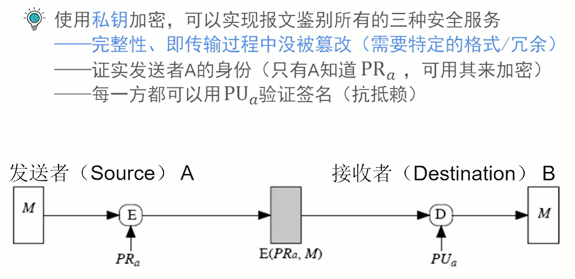

# 信息安全（密码学基础）

课程链接：https://www.bilibili.com/video/BV1p741137oA

## 密码理论

### 公开密钥

- 公钥：用于加密明文，验证签名
- 私钥：用于解密，签名

RSA 算法：
- 分组加密方法
- 理论基础：要求得两个大素数的乘积是容易的，但要分解一个合数为两个大素数的乘积，则在计算上几乎是不可能的

Diffie-Hellman 密钥交换
- 第一个公钥方案
- 有限域上计算离散对数的问题

### 安全服务 / 安全需求

- 保密性（Confidentiality）
- 完整性（Integrity）
- 可用性（Availability）
- 可认证（Authentication）
- 抗抵赖性 / 抗否认（Non-repudiation）

### 报文鉴别的安全需求

1. 保护报文的完整性
2. 验证发送者的身份
3. 抗抵赖：防止报文发送者抵赖（解决争议）（接收者不能伪造报文，发送者不能否认报文）

实现方案：
- 报文加密
- 报文鉴别码（MAC）
- Hash（哈希）函数

#### MAC 的性质

#### hash 函数

hash 函数性质

对 hash 函数的要求

## SSL/TLS

传输层安全协议：TLS（Transport Layer Security）

### SSL 工作流程

## 证书

PKI（Public Key Infrastructure）

PKI 提供的基本服务

## 身份认证

