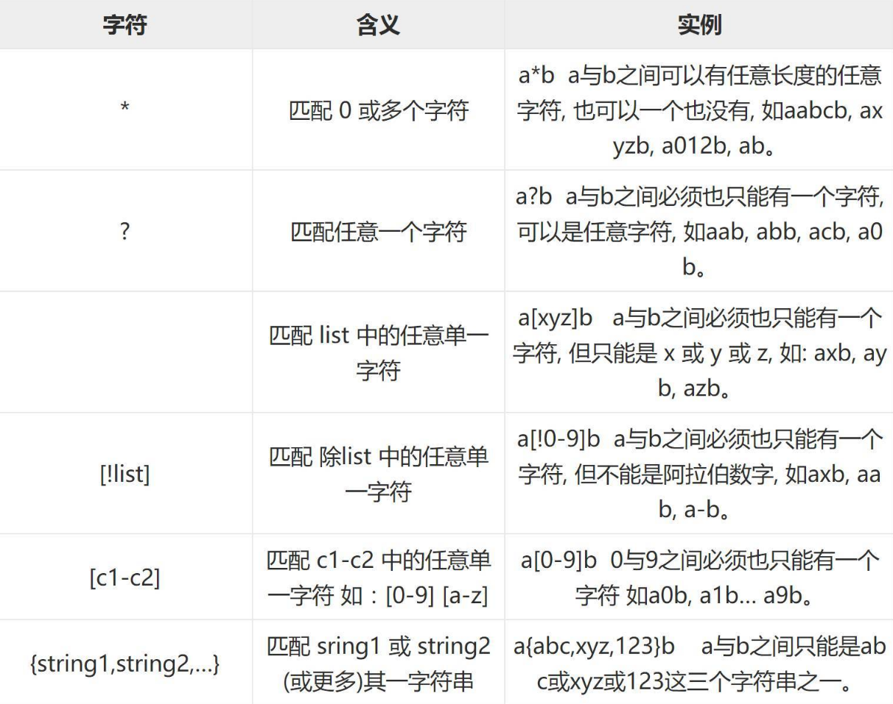
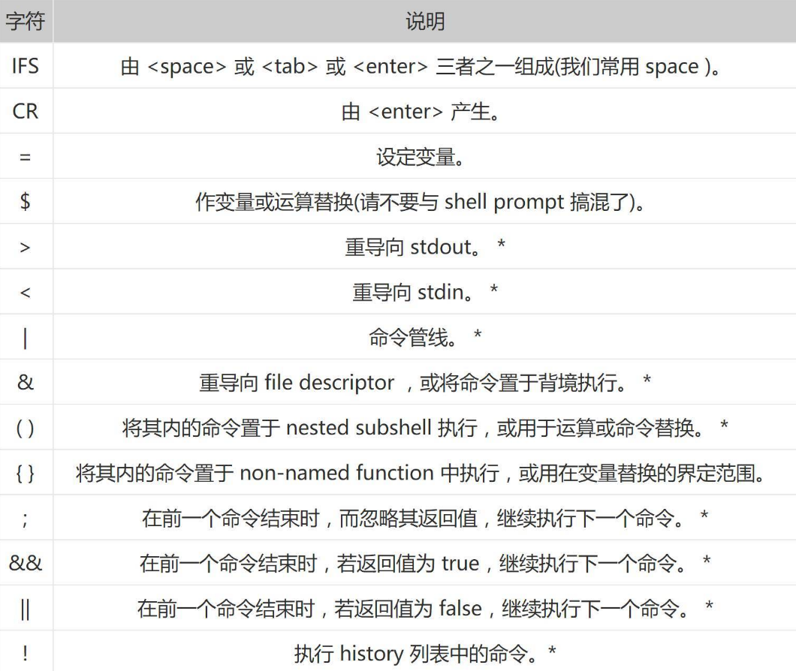

# Linux 操作

## 常用命令英文全称

- apt：Advanced Packaging Tool 高级包装工具
- cp：Copy file 复制文件
- cat：Concatenate 串联
- cd：Change directory 切换目录
- chmod：Change mode 改变模式
- chown：Change owner 改变所有者
- chgrp：Change group 改变用户组
- df：Disk free 空余硬盘
- du：Disk usage 硬盘使用率
- dd：本来应根据其功能描述 Convert an copy 命名为 cc，但 cc 已经被用以代表 C Complier，所以命名为 dd
- fg：Foreground 前景
- fsck：File system check 文件系统检查
- insmod：Install module 安装模块
- ln：Link files 链接文件
- lsmod：List module 列表模块
- ls：List files 列出目录下的文件
- ldd：List dynamic dependencies 列出动态相依
- mv：Move file 移动文件
- mkdir：Make directory 建立目录
- mkfs：Make file system 建立文件系统
- man：Manual 意思是手册，可以用这个命令查询其他命令的用法
- ps：Process Status 进程状态
- pwd：Print working directory 显示当前工作路径
- rm：Remove file 删除文件
- rmmod：Remove module 删除模块
- rmdir：Remove directory 移动目录
- su：Swith user 切换用户，切换到 root 用户
- tar：Tape archive 解压文件
- umount：Unmount 卸载
- uname：Unix name 系统名称
- 
- /bin = BINaries
- /dev = DEVices
- /etc = editable text configurationChest 存放配置文件的地方，配置文件的目录
- /opt = Optional application software packages 可选应用软件包
- /lib = library 库
- /proc = processes 进程
- /sbin = Superuser binaries 超级用户的二进制文件
- /tmp = temporary 临时文件存放
- /usr = Unix shared resources Unix 共享资源
- /var = Variable 是储存各种变化的文件，比如 log 等等

## Shell 通配符、元字符、转义符

1. 通配符是 shell 在做 PathnameExpansion(路径名扩展) 时用到的。一般只用于文件名匹配，它是由 shell 解析的，比如 find、ls、cp、mv 等。



2. Shell Meta 字符



3. 转义字符：将通配符或元字符变为普通字符。


## 查找

1. find
`find < 指定目录 > < 指定条件 > < 指定动作 >`
- <指定目录>：所要搜索的目录及其所有子目录。默认为当前目录。
- <指定条件>：所要搜索的文件的特征。
- <指定动作>：对搜索结果进行特定的处理。

```bash
find . -name 'my*' # 搜索当前目录（含子目录，以下同）中以 my 开头的文件
find . -name 'my*' -ls # 搜索当前目录中以 my 开头的文件，并显示它们的详细信息
find /etc -name "[A-Z]*.txt" -print # 在 etc 目录下，查找大写字母开头的 txt 文件
find . -name "out*" -prune -o -name "*.txt" -print # 在当前目录下查找不是 out 开头的 txt 文件
find . -path "./git" -prune -o -name "*.txt" -print # 在当前目录除 git 子目录外查找 txt 文件

# 找出某个文件的所有硬链接，ls 命令 -i 选项可以查看文件的 inode 号
ls -i 1.txt  # 138956 1.txt 
find . -num 138956

# 搜索文件时使用 -iname 参数可以忽略文件名称大小写
```

2. locate
搜索一个数据库（/var/lib/mlocate/mlocate.db）
Linux 系统自动创建数据库，并且每天自动更新一次，使用 `updatedb` 手动更新数据库。

```bash
locate passwd   # 查找 passwd 文件
locate /etc/sh   # 搜索 etc 目录下所有以 sh 开头的文件
locate -i ~/r   # 忽略大小写搜索当前用户目录下所有以 r 开头的文件
```

3. whereis
只能用于查找二进制文件、源代码文件和 man 手册页。

4. which
在 PATH 变量指定的路径中，搜索某个系统命令的位置，并且返回第一个搜索结果。也就是说，使用 which 命令，就可以看到某个系统命令是否存在，以及执行的到底是哪一个位置的命令。


## Could not get lock /var/lib/dpkg/lock-frontend

使用 apt 安装时报错：
```
E: Could not get lock /var/lib/dpkg/lock-frontend - open (11: Resource temporarily unavailable)
E: Unable to acquire the dpkg frontend lock (/var/lib/dpkg/lock-frontend), is another process using it?
```

```bash
# 方法 1
sudo killall apt apt-get

# 方法 2
sudo rm /var/lib/apt/lists/lock
sudo rm /var/cache/apt/archives/lock
sudo rm /var/lib/dpkg/lock*
sudo dpkg --configure -a
sudo apt update
```

## ssh 远程服务

```bash
# 1. 查看当前的 ubuntu 是否安装了 ssh-server 服务
dpkg -l | grep ssh

# 2. 安装 openssh-server
sudo apt install openssh-server

# 3. 查看 ssh-server 是否启动
ps -e | grep ssh

# 4. 启动
sudo /etc/init.d/ssh start
sudo service ssh start

# 5. 修改配置文件（需要重启服务）
# 配置文件位置：/etc/ssh/sshd_config
# PermitRootLogin yes
```

## 利用 ssh 传输文件

1. 从服务器下载文件
```bash
scp username@servername:/path/filename /var/www/local_dir（本地目录）
# scp root@192.168.0.101:/var/www/test.txt
# 把 192.168.0.101 上的 / var/www/test.txt 的文件下载到 / var/www/local_dir（本地目录）
```

2. 上传本地文件到服务器
```bash
scp /path/filename username@servername:/path
# scp /var/www/test.php  root@192.168.0.101:/var/www/
# 把本机 / var/www / 目录下的 test.php 文件上传到 192.168.0.101 这台服务器上的 / var/www / 目录中
```

3. 从服务器下载整个目录
```bash
scp -r username@servername:/var/www/remote_dir/（远程目录） /var/www/local_dir（本地目录）
# scp -r root@192.168.0.101:/var/www/test  /var/www/
```

4. 上传目录到服务器
```bash
scp  -r local_dir username@servername:remote_dir
# scp -r test  root@192.168.0.101:/var/www/   把当前目录下的 test 目录上传到服务器的 / var/www/ 目录
```

## 安装 VM tools

```bash
# 1. 更新软件库
sudo apt update
# 2. 安装 VMware Tools
sudo apt-get install open-vm-tools-desktop -y
# 3. 重启虚拟机
sudo reboot
```

## 重启网卡

```bash
# 方法一
service networking restart

# 方法二
ifdown eth0
ifup eth0

# 方法三
systemctl restart NetworkManager.service
```

## Ubuntu18.04 关闭和开启图形界面

```bash
# 关闭用户图形界面，使用 tty 登录
sudo systemctl set-default multi-user.target

# 开启用户图形界面
sudo systemctl set-default graphical.target
sudo reboot
```

## ext4 文件系统

- `超级块`：ext4 文件块最开头的部分，记录分区中包含的文件总数。
- `超级块副本`：备份，不止一份。
- `i 节点（inode）`：每一个文件的大小，编号，权限，注意`文件名记录在父目录的 i 节点`。
- `数据块（datablock）`：数据。
- 
- `mv`：改父目录记录的信息，文件内容没有变化。
- `vi`：i 节点信息发生变化。
