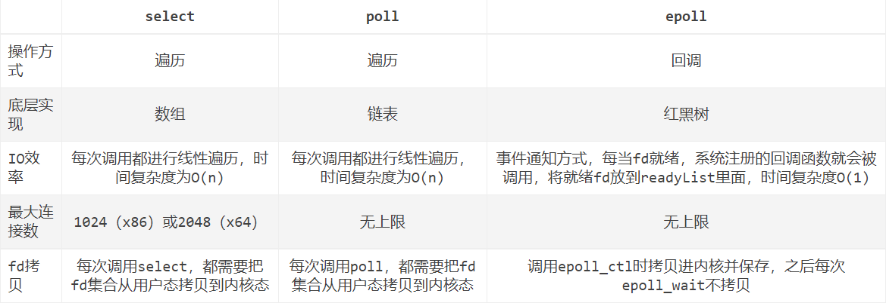

# I/O 多路复用（select、poll、epoll）

转自 https://blog.csdn.net/Geffin/article/details/105364662

## 1 前言

select、poll、epoll 都是 IO 多路复用的机制。何为 IO 多路复用的机制？IO 多路复用的本质是通过一种机制，让单个进程可以监视多个描述符，当发现某个描述符就绪之后，能够通知程序进行相应的读写操作。

select、poll、epoll 都是同步 IO。所谓同步 IO，便是读写是阻塞的，需要在读写事件就绪后自己负责读写，而异步 IO 会把数据从内核拷贝到用户空间，并不需要自己负责读写。

## 2 select

### 2.1 函数定义

我们来看一下 select 函数的定义：
```c
int select(int maxfdp1, fd_set *readset, fd_set *writeset, fd_set *exceptset, const struct timeval *timeout);
```

### 2.2 参数

select 函数的参数如下：
1. `int maxfdp1`：待测试的文件描述字个数。
2. `fd_set *readset` , `fd_set *writeset`，`fd_set *exceptset`：fd_set 是一个集合，里面存放的是文件描述符，三个参数分别表示让内核测试读、写和异常条件的文件描述符集合。若对某一条件不感兴趣，可以将其设置为空指针。
3. `const struct timeval *timeout`：告诉内核，等待所指定文件描述符集合中的任意一个就绪，一共可以花费多少时间。

### 2.3 返回值

返回值类型为 int，若有就绪描述符，则返回其数目，若超时则返回 0，若出错则返回 -1。

### 2.4 运行机制

我们上面提到过，传入的参数有一个 fd_set 集合，其实这是一个 long 类型的数组，数组元素能够与已经打开的文件句柄（例如 Socket 句柄，又或者其它文件）建立联系。

当我们调用 select 函数时，内核会根据 IO 状态对 fd_set 的内容进行修改，从而通知执行 select 函数的进程哪一个文件或者 Socket 是可读的。

select 函数与同步阻塞模型并无过多区别，甚至还多出了一部分操作（监视 socket / 调用 select 函数），导致更低的效率。

### 2.5 优势

用户可以在一个线程内同时处理多个 socket 的 IO 请求。用户可以注册多个 socket，然后调用 select 函数读取被激活的 socket，从而实现在同一个线程内同时处理多个 IO 请求，在这点上 select 函数与同步阻塞模型不同，因为在同步阻塞模型中需要通过多线程才能达到这个目的。

话说回来，为啥我们不直接使用多进程 / 多线程技术，而是要使用 IO 多路复用技术呢？这是因为，使用 IO 多路复用技术，系统不必创建和维护进程 / 线程，从而节约了系统的开销。

### 2.6 缺点

1.  调用 select 函数时，需要把 `fd_set` 集合从`用户态`拷贝到`内核态`，当 fd_set 集合很大时，这个开销将会非常巨大。
2.  调用 select 函数时，需要在内核`遍历`传递进来的所有 fd_set，当 fd_set 集合很大时，这个开销将会非常巨大。
3.  内核对被监控的 fd_set 集合大小做了限制。

## 3 poll

poll 的机制与 select 几乎相同，会对管理的描述符进行轮询操作，并根据描述符的状态进行相应的处理。

poll 将用户传入的数组拷贝到内核空间，然后查询每个描述符对应的设备状态，如果设备就绪则在设备等待队列中加入一项并继续遍历，如果遍历完所有描述符后没有发现就绪设备，则挂起当前进程，直到设备就绪或者主动超时。

### 3.1 poll 与 select 的区别

select 函数中，内核对 fd_set 集合的大小做出了限制，大小不可变为 1024；而 poll 函数中，并没有最大文件描述符数量的限制（基于`链表`存储）。

### 3.2 函数定义

```c
int poll(struct pollfd *fds, nfds_t nfds, int timeout);
```

### 3.3 参数

1. `struct pollfd *fds`：存放需要检测状态的 socket 描述符，调用 poll 函数后，fds 数组不会被清空。pollfd 结构体表示一个被监视的文件描述符，poll 函数会通过 fds 参数的传递来监视多个文件描述符。
2. `nfds_t nfds`：记录 fds 中描述符的总数量。

### 3.4 返回值

返回值类型为 int，返回 fds 集合中就绪的读、写或出错的描述符数量，若返回 0 则表示超时，若返回 -1 则表示出错。

## 4 epoll

epoll 是基于事件驱动的 IO 方式，与 select 相比，epoll 并没有描述符个数限制。

epoll 使用一个文件描述符管理多个描述符，它将文件描述符的事件放入内核的一个事件表中，从而在用户空间和内核空间的复制操作只用实行一次即可。

### 4.1 函数定义

```c
int epoll_create(int size);
int epoll_ctl(int epfd, int op, int fd, struct epoll_event *event);
int epoll_wait(int epfd, struct epoll_event * events, int maxevents, int timeout);
```

各个函数的作用如下：
1. `epoll_create`：创建一个 epoll 句柄，其中 size 表示内核要监听的描述符数量。
2. `epoll_ctl`：注册要监听的事件类型。在每次注册新的事件到 epoll 句柄中时，会把所有的描述符拷贝进内核，而不是在 epoll_wait 的时候重复拷贝。epoll 保证了每个描述符在整个过程中只会拷贝一次。
3. `epoll_wait`：等待事件的就绪，成功时返回就绪的事件数目。

### 4.2 特点

epoll 是 poll 的增强版，在获取事件时，epoll 无需遍历整个被监听的描述符集，而是只需遍历被内核 IO 事件异步唤醒而加入 Ready 队列的描述符集合即可。因此，epoll 能显著提高程序在大量并发连接中只有少量活跃的情况下的系统 CPU 利用率。

epoll 会在 `epoll_ctl` 时为每个描述符指定一个回调函数，当设备就绪，唤醒等待队列上的等待者时，就会调用这个回调函数，而这个回调函数会把就绪的描述符加入一个就绪链表。epoll_wait 实际上就是去就绪链表中查看有没有就绪的描述符。

### 4.3 优势

1.  没有最大并发连接的限制。
2.  不采取轮询的方式，效率高，只会处理活跃的连接，与连接总数无关。

### 4.4 两种模式

epoll 提供了两种模式，一种是水平触发，一种是边缘触发。边缘触发与水平触发相比较，可以使用户空间程序可能缓存 IO 状态，并减少 epoll_wait 的调用，从而提高应用程序的效率。

1. 水平触发（LT）：默认工作模式，当 epoll_wait 检测到某描述符事件就绪并通知应用程序时，应用程序可以`不立即处理该事件`；等到下次调用 epoll_wait 时，会再次通知此事件。
2. 边缘触发（ET）：当 epoll_wait 检测到某描述符事件就绪并通知应用程序时，应用程序必须立即处理该事件。如果不处理，下次调用 epoll_wait 时，`不会再次通知`此事件。

ET 模式减少了 epoll 事件的触发次数，其效率比 LT 模式下高。为什么呢？

如果我们使用 LT 模式的话，系统中一旦有大量不需要读写的就绪文件描述符，每次调用 epoll_wait 都会返回，大大降低处理程序检索自己关心的就绪文件描述符的效率。如果使用的是 ET 模式，当被监控的文件描述符上有可读写事件发生时，epoll\_wait 会通知处理程序去读写，如果这次没有把数据全部读写完，下次调用 epoll\_wait 不会通知你，即它只会通知你一次，直到该文件描述符上出现第二次可读写事件才会通知你。在这种模式下，系统不会充斥大量你不关心的就绪文件描述符，故其效率较高。

## 5 总结

select、poll 需要自己不断轮询所有描述符集合，直到设备就绪，期间可能要睡眠和唤醒多次交替。epoll 其实也需要调用 epoll_wait 不断轮询就绪链表，期间也可能多次睡眠和唤醒交替，但是它是设备就绪时，调用回调函数，把就绪描述符放入就绪链表中，并唤醒在 epoll\_wait 中进入睡眠的进程。虽然都要睡眠和交替，但是 select 和 poll 在醒着的时候要遍历整个描述符集合，而 epoll 在醒着的时候只要判断一下就绪链表是否为空即可，这就是回调机制带来的性能提升，节省了大量的 CPU 时间。

select、poll 每次调用都要将描述符集合从用户态往内核态拷贝一次，而 epoll 只需要一次拷贝即可。

## 6 select，poll，epoll 之间的对比

- IO 效率：select 只知道有 IO 事件发生，却不知道是哪几个流，只能采取轮询所有流的方式，故其具有 O(n) 的无差别轮询复杂度，处理的流越多，无差别轮询时间就越长；poll 与 select 并无区别，它的时间复杂度也是 O(n)；epoll 会将哪个流发生了怎样的 IO 事件通知我们（当描述符就绪时，系统注册的回调函数会被调用，将就绪描述符放到 readyList 里面），它是事件驱动的，其时间复杂度为 O(1)。
- 操作方式：select 和 poll 都是采取`遍历`的方式，而 epoll 则是采取了`回调`的方式。
- 底层实现：select 的底层实现为`数组`，poll 的底层实现为`链表`，而 epoll 的底层实现为`红黑树`。
- 最大连接数：select 的最大连接数为 1024 或 2048，而 poll 和 epoll 是无上限的。
- 对描述符的拷贝：select 和 poll `每次`被调用时都会把描述符集合从用户态拷贝到内核态，而 epoll 在调用 epoll\_ctl 时会拷贝进内核并保存，之后每次 epoll\_wait 时不会拷贝。
- 性能：epoll 在绝大多数情况下性能远超 select 和 poll，但在连接数少并且连接都十分活跃的情况下，select 和 poll 的性能可能比 epoll 好，因为 epoll 的通知机制需要很多函数回调。



参考：
- [IO 多路复用的三种机制 Select，Poll，Epoll](https://www.jianshu.com/p/397449cadc9a)
- [select、poll、epoll 之间的区别（搜狗面试）](https://www.cnblogs.com/aspirant/p/9166944.html)
