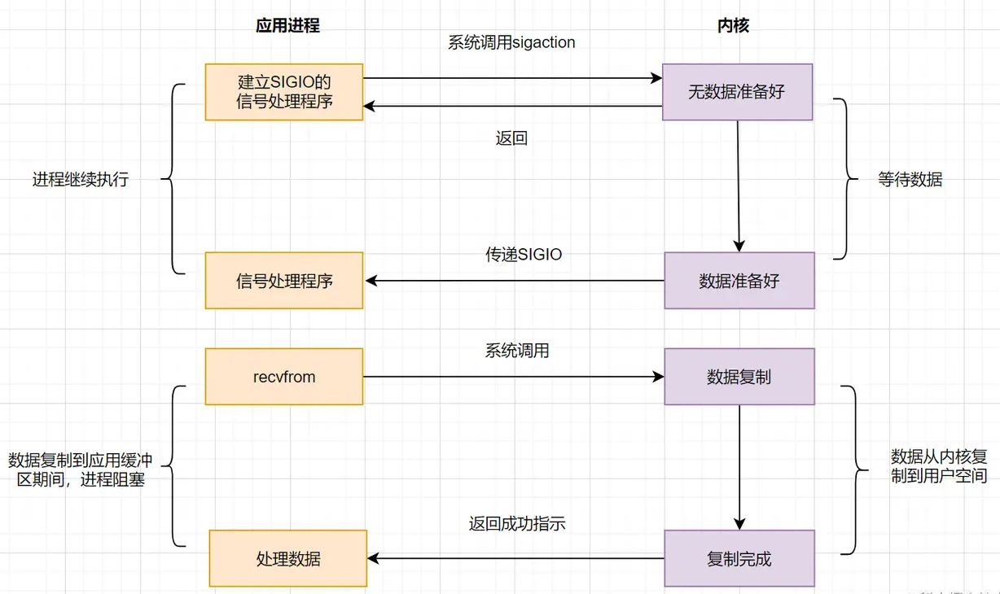

# I/O 模型

转自：https://juejin.cn/post/7036518015462015006

## 操作系统的一次 I/O 过程

应用程序发起的一次 I/O 操作包含两个阶段：
1. I/O 调用：应用程序进程向操作系统内核发起调用。
2. I/O 执行：操作系统内核完成 I/O 操作。

操作系统内核完成 I/O 操作还包括连个两个过程：
1. 准备数据阶段：内核等待 I/O 设备准备好数据。
2. 拷贝数据阶段：将数据从内核缓冲区拷贝到用户空间缓冲区。

一个完整的 I/O 过程包括以下几个步骤：
1. 应用程序进程向操作系统发起 I/O 调用请求。
2. 操作系统准备数据，把 I/O 外部设备的数据，加载到内核缓冲区。
3. 操作系统拷贝数据，即将内核缓冲区的数据，拷贝到进程缓冲区。

## I/O 模型

### 阻塞 I/O

假设应用程序的进程发起 I/O 调用，但是如果内核的数据还没准备好的话，那应用程序进程就一直在阻塞等待，一直等到内核数据准备好了，从内核拷贝到用户空间，才返回成功提示，此次 I/O 操作，称之为阻塞 I/O。

阻塞 I/O 的缺点就是：如果内核数据一直没准备好，那用户进程将一直阻塞，浪费性能，可以使用非阻塞 I/O 优化。

### 非阻塞 I/O（NI/O）

如果内核数据还没准备好，可以先返回错误信息给用户进程，让它不需要等待，而是通过轮询的方式再来请求。这就是非阻塞 I/O，流程图如下：

非阻塞 I/O 的流程如下：

1. 应用进程向操作系统内核，发起 recvfrom 读取数据。
2. 操作系统内核数据没有准备好，立即返回 EWOULDBLOCK 错误码。
3. 应用程序轮询调用，继续向操作系统内核发起 recvfrom 读取数据。
4. 操作系统内核数据准备好了，从内核缓冲区拷贝到用户空间。
5. 完成调用，返回成功提示。

非阻塞 I/O 相对于阻塞 I/O，虽然大幅提升了性能，但是它依然存在性能问题，即频繁的轮询，导致频繁的系统调用，同样会消耗大量的 CPU 资源。可以考虑 I/O 复用模型，去解决这个问题。

### I/O 多路复用

> [!note|label: 文件描述符 fd（File Descriptor）]
>
> 文件描述符在形式上是一个非负整数。实际上，它是一个索引值，指向内核为每一个进程所维护的该进程打开文件的记录表。当程序打开一个现有文件或者创建一个新文件时，内核向进程返回一个文件描述符。

I/O 复用模型核心思路：系统给我们提供一类函数，它们可以同时监控多个 fd 的操作，任何一个返回内核数据就绪，应用进程再发起 recvfrom 系统调用。

#### select

应用进程通过调用 select 函数，可以同时监控多个 fd，在 select 函数监控的 fd 中，只要有任何一个数据状态准备就绪了，select 函数就会返回可读状态，这时应用进程再发起 recvfrom 请求去读取数据。

非阻塞 I/O 模型（NIO）中，需要 N（N>=1）次轮询系统调用，然而借助 select 的 I/O 多路复用模型，只需要发起一次系统调用就够了，大大优化了性能。

select 缺点：
1. 监听的 I/O 最大连接数有限，在 Linux 系统上一般为 1024。
2. select 函数返回后，是通过遍历 fdset，找到就绪的描述符 fd。（仅知道有 I/O 事件发生，却不知是哪几个流，所以遍历所有流）。

因为存在连接数限制，所以后来又提出了 poll。与 select 相比，poll 解决了连接数限制问题。但是 select 和 poll 一样，还是需要通过遍历文件描述符来获取已经就绪的 socket。如果同时连接的大量客户端在一时刻可能只有极少处于就绪状态，伴随着监视的描述符数量的增长，效率也会线性下降。

#### epoll

为了解决 select/poll 存在的问题，多路复用模型 epoll 诞生，它采用事件驱动来实现，流程图如下：

epoll 先通过 epoll_ctl() 来注册一个 fd（文件描述符），一旦基于某个 fd 就绪时，内核会采用回调机制，迅速激活这个 fd，当进程调用 epoll_wait() 时便得到通知。这里去掉了遍历文件描述符的操作，而是采用 ` 监听事件回调 ` 的的机制。

#### select、poll、epoll 的区别

### 信号驱动模型

信号驱动 I/O 不再用主动询问的方式去确认数据是否就绪，而是向内核发送一个信号（调用 sigaction 的时候建立一个 SIGIO 的信号），然后应用用户进程可以去做别的事，不用阻塞。当内核数据准备好后，再通过 SIGIO 信号通知应用进程，数据准备好后的可读状态。应用用户进程收到信号之后，立即调用 recvfrom，去读取数据。

### 异步 I/O（AIO）

前面讲的 BIO，NIO 和信号驱动，在数据从内核复制到应用缓冲的时候，都是阻塞的，因此都不是真正的异步。AIO 实现了 I/O 全流程的非阻塞，就是应用进程发出系统调用后，是立即返回的，但是立即返回的不是处理结果，而是表示提交成功类似的意思。等内核数据准备好，将数据拷贝到用户进程缓冲区，发送信号通知用户进程 I/O 操作执行完毕。

## 阻塞、非阻塞、同步、异步 I/O 划分

### 阻塞和非阻塞

- 阻塞和非阻塞与程序（线程）`等待消息通知时的状态`有关。
- 阻塞和非阻塞关注的是程序在等待调用结果（消息、返回值）时的状态。
- 阻塞调用是指调用结果返回之前，当前线程会被挂起。调用线程只有`在得到结果之后`才会返回。
- 非阻塞调用指在不能立刻得到结果之前，该调用不会阻塞当前线程。

### 异步和同步

- 同步：发出一个功能调用时，在没有得到结果之前，该调用就不返回或继续执行后续操作。
- 异步：当一个异步过程调用发出后，调用者在没有得到结果之前，就可以继续执行后续操作。当这个调用完成后，一般通过状态、通知和回调来通知调用者。对于异步调用，调用的返回并不受调用者控制。

对于通知调用者的三种方式，具体如下：
- 状态：即监听被调用者的状态（轮询），调用者需要每隔一定时间检查一次，效率会很低。
- 通知：当被调用者执行完成后，发出通知告知调用者，无需消耗太多性能。
- 回调：与通知类似，当被调用者执行完成后，会调用调用者提供的回调函数。

同步和异步的区别：请求发出后，`是否需要等待结果`，才能继续执行其他操作。