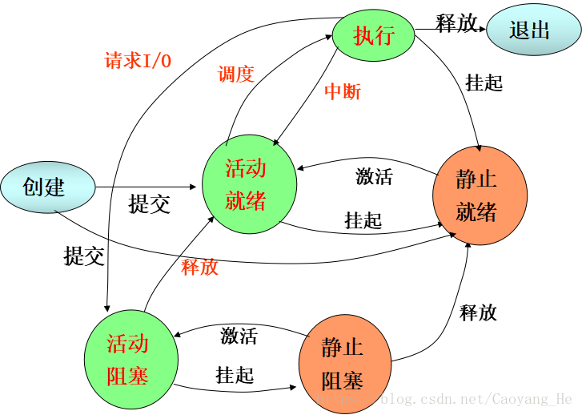

# 操作系统基础

## 内核空间和用户空间

虚拟内存被操作系统划分成两块：内核空间和用户空间，内核空间是内核代码运行的地方，用户空间是用户程序代码运行的地方。当进程运行在内核空间时就处于内核态，当进程运行在用户空间时就处于用户态。

32 位 inux 虚拟地址空间划分如下：

划分原因如下：
1. 安全：内核有控制和分配所有硬件资源的权限，而对于普通应用程序来说，这是不必要的，也是不安全的。划分使得普通程序的错误不会影响整个系统的稳定性。
2. 权限问题：内核空间的代码主要管理各种底层资源，而用户空间的代码主要实现业务逻辑。所以内核空间和用户空间在运行时，cpu 的权限是不同的。
3. 核心代码和业务代码的解耦：内核代码偏重于管理系统资源，而用户代码侧重于业务逻辑，通过划分解耦二者，使得用户操作变得简单。

正是有了不同运行状态的划分，才有了上下文的概念。用户空间的应用程序，如果想要请求系统服务，比如操作一个物理设备，或者映射一段设备空间的地址到用户空间，就必须通过系统调用来（操作系统提供给用户空间的接口函数）实现。

所谓的进程上下文，就是一个进程在执行的时候，CPU 的所有寄存器中的值、进程的状态以及堆栈中的内容，当内核需要切换到另一个进程时，它需要保存当前进程的所有状态，即保存当前进程的进程上下文，以便再次执行该进程时，能够恢复切换时的状态，继续执行。

## 进程切换

为了控制进程的执行，内核必须有能力挂起正在 CPU 上运行的进程，并恢复以前挂起的某个进程的执行。这种行为被称为进程切换。因此可以说，任何进程都是在操作系统内核的支持下运行的，是与内核紧密相关的。

从一个进程的运行转到另一个进程上运行，这个过程中经过下面这些变化：
1. 保存处理机上下文，包括程序计数器和其他寄存器。
2. 更新 PCB 信息。
3. 把进程的 PCB 移入相应的队列，如就绪、在某事件阻塞等队列。
4. 选择另一个进程执行，并更新其 PCB。
5. 更新内存管理的数据结构。
6. 恢复处理机上下文。

## 进程状态

基本状态（创建、就绪、执行、阻塞、终止）
- 创建状态：进程刚创建，但还不能运行，OS 还没有把它加到可执行进程组中，通常是还没有加载到主存中的新进程。
- 就绪状态 ：一个进程获得了除处理机外的一切所需资源，一旦得到处理机即可运行，则称此进程处于就绪状态。
- 执行状态：当一个进程在处理机上运行时，则称该进程处于运行状态。
- 阻塞状态：一个进程正在等待某一事件发生（例如请求 I／O 而等待 I／O 完成等）而暂时停止运行，这时即使把处理机分配给进程也无法运行，故称该进程处于阻塞状态。
- 终止状态：OS 从可执行进程组中释放出的进程，或者是因为它自身停止了，或者是因为某种原因被取消。进程不在适合执行，但与作业相关的表和其它信息临时被 OS 保留起来，为其他程序提供所需信息。

挂起操作
- 挂起状态：由于 IO 的速度慢于 CPU 的运算速度，经常出现 CPU 等待 I/O 的情况。这时 OS 需要将主存中的进程对换至外存。在进程行为模式中需要增加一个新的挂起（suspend）状态。当内存中所有进程阻塞时，OS 可将一进程置为挂起态并交换到外存，再调入另一个进程执行。
- 活动就绪：指进程在主存并旦可被调度的状态。
- 活动阻塞：指进程在主存中。一旦等待的事件产生，便进入活跃就绪状态。
- 静止就绪：指进程被对换到辅存时的就绪状态，是不能被直接调度的状态，只有当主存中没有活跃就绪态进程，或者是挂起态进程具有更高的优先级，系统将把挂起就绪态进程调回主存并转换为活跃就绪。
- 静止阻塞：指进程对换到辅存时的阻塞状态。一旦等待的事件产生，便进入静止就绪状态。

## SIGTERM 与 SIGKILL

- SIGTERM 优雅地终止进程，而 SIGKILL 则立即终止进程。
- 可以`处理、忽略和阻塞` SIGTERM 信号，但是不能处理或阻塞 SIGKILL。
- SIGTERM 不会杀死子进程。SIGKILL 会杀死子进程。
- 有了 SIGTERM，一个进程就有时间将信息发送给它的父进程和子进程。它的子进程由 init 处理。
- 使用 SIGKILL 可能会导致创建僵死进程，因为被杀死的进程没有机会告诉它的父进程它已经收到了一个杀死信号。

## 位 字节 字 字长

- `位`：最小的存储单位称为位（bit）。只能容纳两个值（0 或 1）。位是计算机存储的基本单位。
- `字节（byte）`：一个字节 8 位。一个字节包含 256 种可能的 0/1 组合。
- `字`：计算机进行数据处理时，一次存取、加工和传送的数据长度称为字（word）。一个字通常由一个或多个（一般是字节的整数位）字节构成。
- `字长`：计算机的`每个字所包含的位数`称为字长。根据计算机的不同，字长有固定的和可变的两种。固定字长，即字长度不论什么情况都是固定不变的；可变字长，则在一定范围内，其长度是可变的。
    - 机器字长：CPU 一次能处理数据的位数，通常与 CPU 的寄存器位数有关。
    - 存储字长：存储器中一个存储单元 (存储地址) 所存储的二进制代码的位数，即存储器中的 MDR 的位数。
    - 指令字长：计算机指令字的位数。
    - 数据字长：计算机数据存储所占用的位数。

