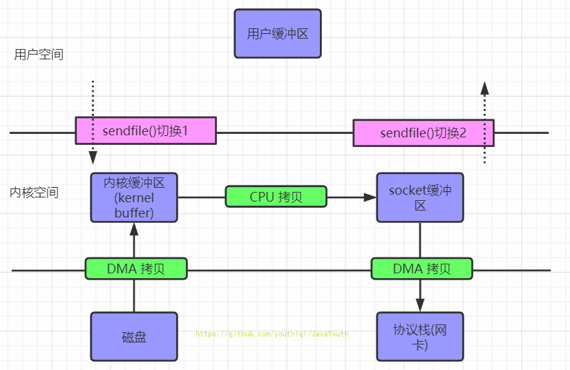

# 零拷贝

来源：https://github.com/youthlql/JavaYouth

关键问题：操作系统检查设备状态时如何避免频繁轮询，从而降低管理设备的 CPU 开销？

## 利用中断减少 CPU 开销

有了中断后，CPU 不再需要不断轮询设备，而是向设备发出一个请求，然后就可以让对应进程睡眠，切换执行其他任务。当设备完成了自身操作，会抛出一个硬件中断，引发 CPU 跳转执行操作系统预先定义好的中断服务例程（InterruptService Routine，ISR），或更为简单的中断处理程序（interrupt handler）。中断处理程序是一小段操作系统代码，它会结束之前的请求（比如从设备读取到了数据或者错误码）并且唤醒等待 I/O 的进程继续执行。

## 利用 DMA 进行更高效的数据传送

过程：
1. 用户进程调用 read 方法，向 cpu 发出 I/O 请求。
2. cpu 将 IO 请求交给 DMA 控制器，`之后自己立马返回去执行其他进程的任务`。
3. DMA 向磁盘发起 IO 请求。
4. 磁盘控制器收到指令后，于是就开始进行磁盘 I/O，磁盘 I/O 完成后会把数据放入到磁盘控制器的内部缓冲区中，然后产生一个`中断`。
5. DMA 收到中断后，把磁盘控制器的缓冲区的数据读进内核的页缓存，接着`抛出一个中断`。
6. 操作系统收到中断后，调度 cpu 回来执行之前的进程：将数据从内核页缓存拷贝到用户进程空间（只能用异步 IO 来优化）。
7. 最后 read() 调用返回。

## 零拷贝

### 传统文件 I/O

场景：将磁盘上的文件读取出来，然后通过网络协议发送给客户端。

1. 很明显发生了 4 次拷贝
	- 第一次拷贝，把`磁盘`上的数据拷贝到操作系统的`内核缓冲区`里，这个拷贝是通过 DMA 的。
	- 第二次拷贝，把`内核缓冲区`的数据拷贝到`用户缓冲区`里，于是应用程序就可以使用这部分数据了，这个拷贝是由 CPU 完成的。
	- 第三次拷贝，把刚才拷贝到`用户缓冲区`里的数据，再拷贝到`内核`的 socket 的缓冲区里，这个过程依然由 CPU 完成的。
	- 第四次拷贝，把`内核`的 socket 缓冲区里的数据，拷贝到`协议栈`里，这个过程又是由 DMA 完成的。

2. 发生了 4 次用户上下文切换，因为发生了两个系统调用 read 和 write。一个系统调用对应两次上下文切换，所以上下文切换次数在一般情况下只可能是偶数。

优化：
1. 减少上下文切换次数。
2. 减少数据拷贝次数。

### mmap

`read()` 系统调用的过程中会把内核缓冲区的数据拷贝到用户的缓冲区里，为了减少这一步开销，我们可以用 `mmap()` 替换 `read()` 系统调用函数。`mmap()` 系统调用函数会直接把`内核缓冲区里的数据映射到用户空间`，这样，操作系统内核与用户空间共享缓冲区，就不需要再进行任何的数据拷贝操作。

总的来说 mmap 减少了一次数据拷贝，总共 4 次上下文切换，3 次数据拷贝。

### sendfile

Linux2.1 版本提供了 `sendFile` 函数，其基本原理如下：数据根本不经过用户态，直接从内核缓冲区进入到 `SocketBuffer`。

总的来说有 2 次上下文切换，3 次数据拷贝。

### sendfile 再优化

Linux 在 2.4 版本中，做了一些修改，避免了从内核缓冲区拷贝到 `Socketbuffer` 的操作，直接拷贝到`协议栈`，从而再一次减少了数据拷贝。

