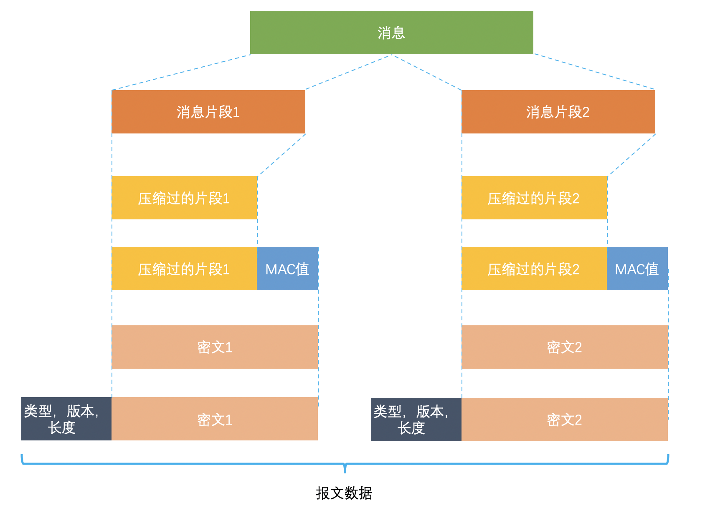

# TLS/SSL

转自：http://www.flydean.com/ssl-tls-all-in-one/

## TLS 协议的架构

TLS 主要分为两层，底层的是 TLS 记录协议，主要负责使用对称密码对消息进行加密。

上层的是 TLS 握手协议，主要分为握手协议，密码规格变更协议和应用数据协议 4 个部分。
- 握手协议负责在客户端和服务器端商定密码算法和共享密钥，包括证书认证，是 4 个协议中最最复杂的部分。
- 密码规格变更协议负责向通信对象传达变更密码方式的信号。
- 警告协议负责在发生错误的时候将错误传达给对方。
- 应用数据协议负责将 TLS 承载的应用数据传达给通信对象的协议。

## 握手协议

握手协议是 TLS 协议中非常重要的协议，通过客户端和服务器端的交互，和共享一些必要信息，从而生成共享密钥和交互证书。

1. `client hello`
客户端向服务器端发送一个 `client hello` 的消息，包含下面内容：
- 可用版本号
- 当前时间
- 客户端随机数：由客户端生成的随机数，用来生成对称密钥。
- 会话 ID：用于保持同一个会话。
- 可用的密码套件清单（Cipher Suite）
- 可用的压缩方式清单（Compression Methods）

2. `server hello`
服务器端收到 client hello 消息后，会向客户端返回一个 `server hello` 消息，包含如下内容：
- 使用的版本号
- 当前时间
- 服务器随机数
- 会话 ID
- 使用的密码套件
- 使用的压缩方式

3. 可选步骤：`certificate`
- 服务器端发送自己的证书清单，因为证书可能是层级结构的，所以处理服务器自己的证书之外，还需要发送为服务器签名的证书。
- 客户端将会对服务器端的证书进行验证。如果是以匿名的方式通信则不需要证书。

4. 可选步骤：`ServerKeyExchange`
- 如果第三步的证书信息不足，则可以发送 ServerKeyExchange 用来构建加密通道。
- ServerKeyExchange 的内容可能包含两种形式：
	如果选择的是 RSA 协议，那么传递的就是 RSA 构建公钥密码的参数（E，N）。
	如果选择的是 Diff-Hellman 密钥交换协议，那么传递的就是密钥交换的参数。

5. 可选步骤：`CertificateReques`
- 如果是在一个受限访问的环境，比如 fabric 中，服务器端也需要向客户端索要证书。
- 如果并不需要客户端认证，则不需要此步骤。

6. `server hello done`
- 服务器端发送 server hello done 的消息告诉客户端自己的消息结束了。

7. 可选步骤：`Certificate`
- 对步骤 5 的回应，客户端发送客户端证书给服务器。

8. `ClientKeyExchange`
- 如果是公钥或者RSA模式情况下，客户端将根据客户端生成的随机数和服务器端生成的随机数，生成`预备主密码`，通过该公钥进行加密，返送给服务器端。
- 如果使用的是Diff-Hellman密钥交换协议，则客户端会发送自己这一方要`生成Diff-Hellman密钥而需要公开的值`，这样服务器端可以根据这个公开值计算出预备主密码。

9. 可选步骤：`CertificateVerify`
- 客户端向服务器端证明自己是客户端证书的持有者。

10. `ChangeCipherSpec`
- ChangeCipherSpec 是密码规格变更协议的消息，表示后面的消息将会以前面协商过的密钥进行加密。

11. `finished`
- 客户端告诉服务器端握手协议结束了。
- 该报文包含连接至今全部报文的整体校验值。这次握手协商是否能够成功，要以服务器是否能够正确解密该报文作为判定标准。

12. `ChangeCipherSpec`
- 服务器端告诉客户端自己要切换密码了。

13. `finished`
- 服务器端告诉客户端，握手协议结束了。

14. 切换到应用数据协议
- 这之后服务器和客户端就是以加密的方式进行沟通了。

## 主密码和预备主密码

上面的步骤8生成了预备主密码，主密码是根据密码套件中定义的单`向散列函数`实现的`伪随机数生成器`+`预备主密码`+`客户端随机数`+`服务器端随机数`生成的。

主密码主要用来生成称密码的密钥，消息认证码的密钥和对称密码的 CBC 模式所使用的初始化向量。

## TLS 记录协议

TLS 记录协议主要负责消息的压缩，加密及数据的认证：

消息首先将会被`分段`，然后`压缩`，再计算其`消息验证码`，然后使用`对称密码`进行加密，加密使用的是CBC模式，CBC模式的初始向量是通过主密码来生成的。

得到密文之后会附加类型，版本和长度等其他信息，最终组成最后的报文数据。

在CBC模式中，首先将`明文分组` `XOR` 前一个`密文分组`，然后再进行`加密`。

