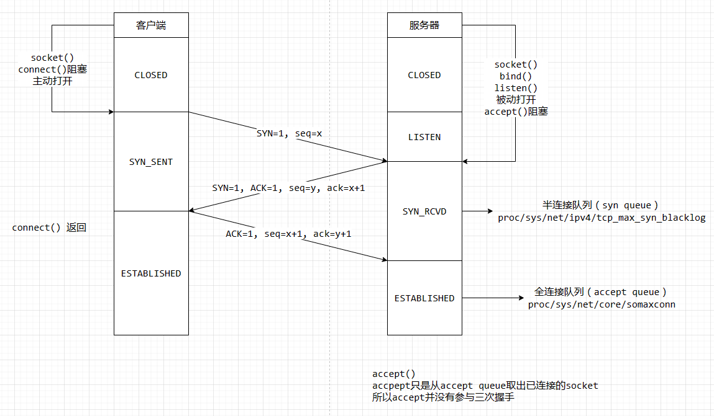
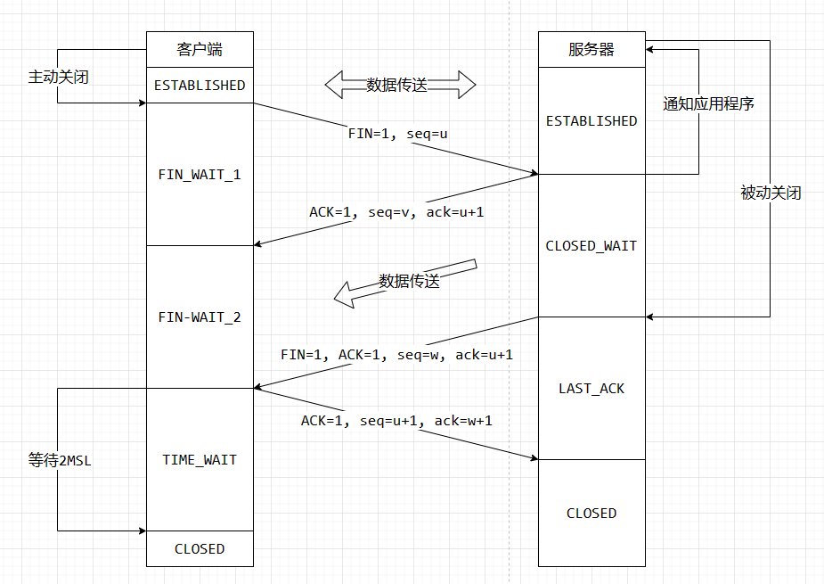

# 三次握手与四次挥手

## 三次握手

1. 第一次握手
	- 客户端在 socket()、connect() 后主动给服务器发送一个 SYN 报文段（在 TCP 标头中 SYN 标志位字段为 1 的数据包），该段中也包含客户端的初始序列号（sequence number=x），这时客户端的状态是 SYN_SENT。
	- 服务器在进行 socket()、bind()、listen() 后等待客户的连接，收到客户端的 SYN 后，
		- 半连接队列（syn queue）未满：服务器将该连接的状态变为 SYN_RCVD，服务器把连接信息放到半连接队列里面；
		- 半连接队列已满：服务器将该连接丢弃。

2. 第二次握手
	- 服务器返回客户端 SYN+ACK 报文段（在 TCP 标头中 SYN 和 ACK 标志位字段都为 1 的数据包），该段中包含服务器的初始序列号（seq number=y）；同时使 acknowledgment number=x+1 来表示确认已收到客户端的 SYN 段。
	- 客户端收到 SYN+ACK 段后，客户端的状态从 SYN_SENT 变为 ESTABLISHED，也是 connect() 函数的返回。

3. 第三次握手
	- 客户端给服务器响应一个 ACK 报文段，该段中使 ack number=y+1 来表示确认已收到服务器的 SYN 报文段。
	- 服务器收到客户端发来的 ACK，
		- 全连接队列（accept queue）未满：服务端该连接的状态从 SYN_RCVD 变为 ESTABLISHED，然后服务器将该连接从半连接队列里面移除，并将该连接的信息放到全连接队列里面；
		- 全连接队列已满：当全连接队列已满时，则根据 tcp_abort_on_overflow 的值来执行相应动作，
			- tcp_abort_on_overflow = 0：重新进行第二次握手（二进制指数退让）
			- tcp_abort_on_overflow = 1

## 四次挥手

TCP 连接的终止需要进行四次挥手才能完成，这里假设终止由客户端发起，但无论客户端还是服务器都可以发起。

1. 第一次挥手
	- 客户端发送 FIN 给服务器，客户端状态由 ESTABLISHED 变为 FIN_WAIT_1。

2. 第二次挥手
	- 服务器收到 FIN 且发送 ACK 给客户端，服务器状态由 ESTABLISHED 变为 CLOSE_WAIT；
	- 服务器将缓存中没发送的数据完继续发送给客户端；
	- 客户端收到 ACK 后状态由 FIN_WAIT_1 变为 FIN_WAIT_2。

3. 第三次挥手
	- 服务器发送 FIN 给客户端，这时服务器的状态由 CLOSE_WAIT 变为 LAST_ACK。

4. 第四次握手
	- 客户端收到 FIN 后返回 ACK 给服务器，然后客户端的状态由 FIN_WAIT_2 变为 TIME_WAIT，TIME_WAIT=2MSL；
	- 服务器收到 ACK 后，状态由 LAST_ACK 变为 CLOSED；
	- 而客户端再经过 TIME_WAIT 时间后变为 CLOSED 状态。

## Q&A

### 为什么需要三次握手？

客户端和服务器的握手过程，不仅仅是确认互相可达的过程，更重要的是一个同步的过程，SYN 就是同步（Synchronize）的缩写。对于 TCP 报文段来说，序号是一个至关重要的部分，它保证了 TCP 传输数据的完整性。TCP 报文的初始序号不是从 0 开始的，而是一个随机的序号，而所谓的同步，就是 TCP 客户端和服务器互相同步初始序号的过程。

第一次握手，客户端发送 SYN 报文，将自己的初始序号发送到了服务器，服务器接收到后，向客户端发送 SYNACK 报文段，告诉客户端已经收到了它的初始序号，同时在这个报文段中带上了自己的初始序号。

这个时候，第三次握手的作用就出来了：第三次握手实际上就是客户端在告诉服务器，自己已经收到了它的初始序号，完成了同步，可以开始相互传输数据了。若没有第三次握手，服务器将无法保证客户端接收到了自己的 SYNACK 报文段，若此时 SYNACK 报文段丢失，客户端不知道服务器的初始序号，将无法处理之后到达客户端的数据。

### 为什么会有 TIME_WAIT 状态？

MSL 即 Maximum Segment Lifetime，也就是报文最大生存时间，引用《TCP/IP 详解》中的话：它 (MSL) 是任何报文段被丢弃前在网络内的最长时间。

1. 可靠地实现 TCP 全双工连接的终止。

客户端接收到服务器发送的 FIN 报文后（第三次挥手），会回送一条确认报文（第四次挥手），但是客户端并不知道这条确认报文是否可以顺利到达服务器。若这条确认报文在传送到服务器的过程中损坏、丢失或超时，将引起服务器重新发送 FIN 报文，客户端接收到后，将需要再次发送一条确认报文，直到服务器正确接收。但是，客户端发送确认报文后，立刻释放资源，将导致无法处理重传的 FIN 报文，所以客户端需要等待一段时间，直到确认没有出现上述情况出现再释放资源。

2. 允许老的重复分节在网络中消逝。

TCP 四次挥手完成后，理论上已经断开了连接，但是这不代表之前通过这条连接发送的所有数据都处理完毕了，有些可能还在网络中传输。若在四次挥手后，立即释放客户端的资源，然后客户端立即以同一个源端口，向服务器的同一个目的端口再次建立一个 TCP 连接，这个连接和上一个的 源端口 + 源 IP + 目的端口 + 目的 IP 都一模一样，此时将会产生问题。若上一次连接遗留在网络中的报文此时到达，将会被当做新连接传输的数据处理，于是可能会产生一些不可预估的错误。所以，客户端在断开连接后，需要等待一段时间，直到网络中遗留的数据都死掉，才释放资源，而在资源没有被释放前，是不允许建立一个 源端口 + 源 IP + 目的端口 + 目的 IP 都一模一样的 TCP 连接的（因为 TCP 套接字由这四部分标识）。
