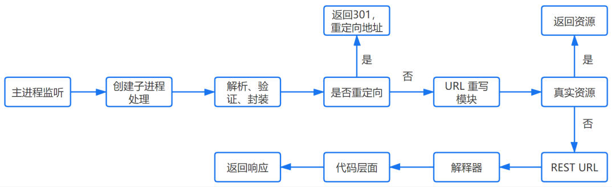

# 在浏览器中输入地址后发生了什么？

https://vincenthou.gitbooks.io/what-happens-when-you-enter-url-in-browser/content/

## URL 解析

用户输入 URL，浏览器会根据用户输入的信息判断是搜索还是网址，如果是搜索内容，就将搜索内容 + 默认搜索引擎合成新的 URL；如果用户输入的内容符合 URL 规则，浏览器就会根据 URL 协议，在这段内容上加上协议合成合法的 URL。

## DNS 域名解析


- 根 DNS 服务器 ：返回顶级域 DNS 服务器的 IP 地址
- 顶级域 DNS 服务器：返回权威 DNS 服务器的 IP 地址
- 权威 DNS 服务器 ：返回相应主机的 IP 地址

DNS 的域名查找，在客户端和浏览器，本地 DNS 之间的查询方式是递归查询；在本地 DNS 服务器与根域及其子域之间的查询方式是迭代查询；


在客户端输入 URL 后，会有一个递归查找的过程：
- 浏览器缓存：先检查是否在缓存中，没有则调用系统库函数进行查询。
- 操作系统缓存：操作系统也有自己的 DNS 缓存，但在这之前，会向检查域名是否存在本地的 Hosts 文件里，没有则向 DNS 服务器发送查询请求。
- 路由器缓存。
- ISP DNS 缓存：ISP DNS 就是在客户端电脑上设置的首选 DNS 服务器，它们在大多数情况下都会有缓存。

这个过程中任何一步找到了都会结束查找流程。

如果本地 DNS 服务器无法查询到，则根据本地 DNS 服务器设置的转发器进行查询。若使用转发模式，此 DNS 服务器就会把请求转发至上一级 DNS 服务器，由上一级服务器进行解析，上一级服务器如果不能解析，或找根 DNS 或把转请求转至上上级，以此循环。

如果未用转发模式，本地 DNS 就把请求发至 13 台根 DNS，根 DNS 服务器收到请求后会判断这个域名（.com）是谁来授权管理，并会返回一个负责该顶级域名服务器的一个 IP。本地 DNS 服务器收到 IP 信息后，将会联系负责. com 域的这台服务器。以此类推。迭代查找过程如下图：


结合起来的过程，可以用一个图表示：


在查找过程中，有以下优化点：
- DNS 存在着多级缓存，从离浏览器的距离排序的话，有以下几种: 浏览器缓存、系统缓存、路由器缓存、IPS 服务器缓存、根域名服务器缓存、顶级域名服务器缓存、主域名服务器缓存。
- 在域名和 IP 的映射过程中，给了应用基于域名做负载均衡的机会，可以是简单的负载均衡，也可以根据地址和运营商做全局的负载均衡。

## 应用层：发送 HTTP 请求

首先，判断是不是 HTTPS，如果是 HTTPS 协议，还需要建立 TLS 连接。

浏览器从地址栏得到服务器 IP，接着构造一个 HTTP 报文，其中包括：
- 请求报头 (Request Header)：请求方法、目标地址、遵循的协议等。
- 请求主体，请求参数，比如 body 里面的参数。


HTTP 报文结构：
1. 起始行 (Start Line)：描述请求或者响应的基本信息。
2. Header：使用 key-value 的形式详细说明报文信息。
3. 空行。
4. 消息正文（Entity）：传输的数据，图片、视频、文本等都可以。

## 表示层：TLS

SSL 工作在 OSI 七层模型中的表示层，TCP/IP 四层模型的应用层。


## 传输层：TCP 传输报文

传输层会发起一条到达服务器的 TCP 连接，为了方便传输，会对数据进行分割（以报文段为单位），并标记编号，方便服务器接受时能够准确地还原报文信息。在建立连接前，会先进行 TCP 三次握手。

三次握手：
- 第一次握手：建立连接。客户端发送连接请求报文段，将 SYN 位置为 1，Sequence Number 为 x；然后，客户端进入 SYN_SEND 状态，等待服务器的确认；
- 第二次握手：服务器收到 SYN 报文段。服务器收到客户端的 SYN 报文段，需要对这个 SYN 报文段进行确认，设置 Acknowledgment Number 为 x+1；同时，自己还要发送 SYN 请求信息，将 SYN 位置为 1，Sequence Number 为 y；服务器端将上述所有信息放到一个报文段（即 SYN+ACK 报文段）中，一并发送给客户端，此时服务器进入 SYN_RECV 状态；
- 第三次握手：客户端收到服务器的 SYN+ACK 报文段。然后将 Acknowledgment Number 设置为 y+1，向服务器发送 ACK 报文段，这个报文段发送完毕以后，客户端和服务器端都进入 ESTABLISHED 状态，完成 TCP 三次握手。


## 网络层：IP 协议查询 MAC 地址

网络层起到转发、路由的作用，即帮数据包找到下一跳的位置。

> [!note|label:路由表]
>
> 每个路由器都会有一个路由表，路由表中记录该路由器（网关）和网络中其他路由器（网关）的连接信息。

```bash
 # linux 系统中执行 route -n 命令，会打印出路由表的信息
 # route -n
 Kernel IP routing table
 Destination     Gateway         Genmask         Flags Metric Ref    Use Iface
 0.0.0.0         172.21.95.253   0.0.0.0         UG    0      0        0 eth0  # 默认网关
 169.254.0.0     0.0.0.0         255.255.0.0     U     1002   0        0 eth0
 172.17.0.0      0.0.0.0         255.255.0.0     U     0      0        0 docker0
 172.21.80.0     0.0.0.0         255.255.240.0   U     0      0        0 eth0
 172.38.0.0      0.0.0.0         255.255.0.0     U     0      0        0 br-a1eafe015e3f
```

目标 IP 和路由表中的子网掩码进行按位与运算得出的结果和 Destination 列进行比较，如果相同，就把数据包发送到该 IP 地址，否则最终会找到默认网关。

TCP 报文段到达之后，网络层会加上目标 IP 和源 IP 等网络层专有头部数据封装成 IP 数据报，此时将 IP 数据报向下传递给数据链路层。

判断目标地址是否与当前地址处于同一网络中，是的话直接根据 Mac 地址发送，否则使用路由表查找下一个地址，以及使用 ARP 协议查询它的 Mac 地址。

ARP 协议：源设备在发送数据给目的设备前，会首先查看自身的 ARP 缓存，查找 ARP 缓存是否在目的设备的 IP 地址和 MAC 地址的映射。如果存在则直接使用，如果不存在则会发送 ARP request。

在 OSI 参考模型中 ARP 协议位于链路层，但在 TCP/IP 中，它位于网络层。

## 链路层：以太网协议

根据以太网协议将数据分为以帧为单位的数据包，每一帧分为两个部分：
- 标头：数据包的发送者、接受者、数据类型
- 数据：数据包具体内容

Mac 地址

以太网规定了连入网络的所有设备都必须具备网卡接口，数据包都是从一块网卡传递到另一块网卡，网卡的地址就是 Mac 地址。每一个 Mac 地址都是独一无二的，具备了一对一的能力。

广播

发送数据的方法很原始，直接把数据通过 ARP 协议，向本网络的所有机器发送，接收方根据标头信息与自身 Mac 地址比较，一致就接受，否则丢弃。

## 物理层

物理层的传输介质包括同轴电缆、双绞线、光纤等。

物理层不会对上层的数据进行处理，它只负责传输信号。

服务器收到后会对数据依次往上传递，并对数据头部进行处理，最终到达应用层，应用层收到后对请求进行处理，返回响应数据，然后将数据依次传递给传输层、网络层...

## 服务器处理请求



1. httpd：它会监听得到的请求，然后开启一个子进程去处理这个请求。
2. 处理请求：接受 TCP 报文后，会对连接进行处理，对 HTTP 协议进行解析（请求方法、域名、路径等），并且进行一些验证：
	- 验证是否配置虚拟主机
	- 验证虚拟主机是否接受此方法
	- 验证该用户可以使用该方法（根据 IP 地址、身份信息等）

3. 重定向：假如服务器配置了 HTTP 重定向，就会返回一个 301 永久重定向响应，浏览器就会根据响应，重新发送 HTTP 请求（重新执行上面的过程）。
4. URL 重写：然后会查看 URL 重写规则，如果请求的文件是真实存在的，比如图片、HTML、CSS、JS 文件等，则会直接把这个文件返回；否则服务器会按照规则把请求重写到 一个 REST 风格的 URL 上。首先会初始化一些环境的参数，根据 URL 由上到下地去匹配路由，然后让路由所定义的方法去处理请求。

## 浏览器接收响应并渲染数据

浏览器接收到来自服务器的响应资源后，会对资源进行分析：
1. 首先查看 Response header，根据不同状态码进行处理；
2. 如果响应资源进行了压缩（比如 gzip），还需要进行解压；
3. 然后，对响应资源做缓存；
4. 接下来，根据响应资源里的 MIME 类型去解析响应内容（比如 HTML、Image 各有不同的解析方式）。
5. HTML 页面渲染：
	1. 浏览器把获取到的 HTML 代码解析成一个 DOM 树；
	2. 把所有样式（主要包括 CSS 和浏览器的样式设置）解析成样式体；
	3. Dom 树和样式结构体结合后构建渲染树（render tree）；
	4. 渲染树构建完毕后，浏览器根据渲染树绘制页面。

